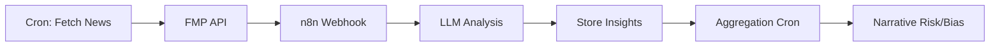

# Auditoría Completa de Engines Fintra - Script para Claude Code

## Instrucciones para Claude Code

Este documento contiene instrucciones para auditar el código real de Fintra y verificar que las metodologías descritas en la documentación estén correctamente implementadas.

**IMPORTANTE:** No modifiques código. Solo audita y reporta.

---

## FASE 1: Verificación de Estructura de Proyecto

### TAREA 1.1: Mapear Arquitectura Real

**Objetivo:** Confirmar que la estructura del proyecto coincide con la documentación.

**Comandos a ejecutar:**

```bash
# 1. Listar estructura de carpetas principales
echo "=== ESTRUCTURA DEL PROYECTO ==="
tree -L 3 -I 'node_modules|.next|.git' > /tmp/fintra-structure.txt
cat /tmp/fintra-structure.txt

# 2. Encontrar archivos de engines
echo "\n=== ARCHIVOS DE ENGINES ==="
find . -type f -name "*fgos*" -o -name "*ifs*" -o -name "*valuation*" -o -name "*life-cycle*" | grep -v node_modules

# 3. Encontrar archivos de cron jobs
echo "\n=== ARCHIVOS DE CRON JOBS ==="
find . -path "*/app/api/cron/*" -type f

# 4. Encontrar archivos de Supabase clients
echo "\n=== CLIENTES SUPABASE ==="
find . -path "*/lib/supabase/*" -type f
```

**Criterios de validación:**

- [ ] Existe `/lib/engine/` con archivos de cálculo
- [ ] Existe `/app/api/cron/` con rutas de cron jobs
- [ ] Existe `/lib/supabase/index.ts` (anon client)
- [ ] Existe `/lib/supabase/admin.ts` (service role client)
- [ ] Archivos usan kebab-case (no camelCase ni snake_case)

**Reportar:**
```markdown
## FASE 1.1: Estructura del Proyecto

✅/❌ Carpeta /lib/engine/ existe
✅/❌ Carpeta /app/api/cron/ existe
✅/❌ Clientes Supabase separados (anon vs admin)
✅/❌ Naming conventions (kebab-case)

### Archivos encontrados:
[Listar archivos principales]

### Discrepancias:
[Listar cualquier diferencia con documentación]
```

---

## FASE 2: Auditoría de FGOS Engine

### TAREA 2.1: Localizar Código de FGOS

```bash
# Encontrar archivo principal de FGOS
find . -type f -name "*fgos*" -o -name "*fintra-brain*" | grep -v node_modules | head -5

# Buscar función principal de cálculo
grep -r "calculateFGOS\|computeFGOS\|fgosScore" --include="*.ts" --include="*.tsx" lib/ app/ | head -10
```

**Criterios:**
- [ ] Existe archivo dedicado a FGOS (ej: `fintra-brain.ts`)
- [ ] Función principal de cálculo identificada

---

### TAREA 2.2: Verificar Validación de Prerequisitos

**Buscar código que valide sector y métricas antes de calcular:**

```bash
# Buscar validaciones de sector
grep -A 10 -B 5 "!sector\|sector.*null\|sector.*undefined" lib/engine/*fgos* lib/engine/*brain* 2>/dev/null

# Buscar validaciones de métricas mínimas
grep -A 10 -B 5 "hasMinimum\|required.*metrics\|insufficient.*data" lib/engine/*fgos* lib/engine/*brain* 2>/dev/null
```

**Criterios esperados (según documentación):**

```typescript
// DEBE existir algo como:
if (!sector) {
  return { 
    fgos_status: 'pending', 
    fgos_score: null,
    reason: 'Sector missing' 
  };
}

if (!hasMinimumMetrics(data)) {
  return { 
    fgos_status: 'pending', 
    fgos_score: null 
  };
}
```

**Reportar:**
```markdown
## FASE 2.2: Validación de Prerequisitos FGOS

✅/❌ Código valida presencia de sector
✅/❌ Retorna 'pending' si falta sector (no throw)
✅/❌ Código valida métricas mínimas
✅/❌ Retorna null en fgos_score si no calcula

### Código encontrado:
```typescript
[Pegar snippet relevante]
```

### Cumplimiento:
- Principio "Fintra no inventa datos": ✅/❌
- Principio "Pending no es error": ✅/❌
```

---

### TAREA 2.3: Verificar Cálculo de Confidence Score

```bash
# Buscar cálculo de confidence
grep -A 20 "fgos.*confidence\|confidence.*fgos\|calculateConfidence" lib/engine/*fgos* lib/engine/*brain* 2>/dev/null
```

**Criterios esperados:**

```typescript
// DEBE incluir confidence en resultado
return {
  fgos_status: 'computed',
  fgos_score: score,
  fgos_confidence: confidence, // 0-100
  // ...
};

// NUNCA debe omitir confidence cuando status = 'computed'
```

**Reportar:**
```markdown
## FASE 2.3: Confidence Score FGOS

✅/❌ Resultado incluye campo fgos_confidence
✅/❌ Confidence es numérico (0-100)
✅/❌ Confidence se calcula (no hardcoded)
✅/❌ NUNCA se omite cuando status='computed'

### Código encontrado:
```typescript
[Pegar snippet]
```

### Interpretación de thresholds:
- Alta (80-100): [encontrado sí/no]
- Media (60-79): [encontrado sí/no]
- Baja (<60): [encontrado sí/no]
```

---

### TAREA 2.4: Verificar Uso de Benchmarks Sectoriales

```bash
# Buscar cómo se obtienen benchmarks
grep -A 15 "getBenchmark\|sectorBenchmark\|benchmark.*sector" lib/engine/*fgos* lib/engine/*brain* lib/engine/*benchmark* 2>/dev/null

# Buscar advertencias de benchmark faltante
grep -A 5 "benchmark.*null\|!benchmark\|missing.*benchmark" lib/engine/*fgos* lib/engine/*brain* 2>/dev/null
```

**Criterios esperados:**

```typescript
// DEBE validar que benchmark existe
const benchmark = await getBenchmark(sector, metric);
if (!benchmark) {
  // DEBE manejar gracefully, no throw
  console.warn(`No benchmark for ${sector} ${metric}`);
  return null; // o ajustar confidence
}

// PROHIBIDO: hardcoded benchmarks universales
// ❌ const goodROIC = 15; // Universal para todos los sectores
```

**Reportar:**
```markdown
## FASE 2.4: Uso de Benchmarks FGOS

✅/❌ Benchmarks son por sector (no universales)
✅/❌ Código valida que benchmark existe
✅/❌ Maneja benchmark faltante gracefully (no throw)
✅/❌ No usa "números mágicos" universales

### Código encontrado:
```typescript
[Pegar snippet]
```

### Infracciones detectadas:
[Listar cualquier hardcoded benchmark universal]
```

---

## FASE 3: Auditoría de TTM Construction

### TAREA 3.1: Localizar Código de TTM

```bash
# Buscar construcción de TTM
grep -r "TTM\|trailingTwelve\|trailing.*twelve\|last.*4.*quarter" --include="*.ts" lib/ | grep -v node_modules | head -15

# Buscar función específica
grep -A 30 "constructTTM\|calculateTTM\|buildTTM" lib/engine/*.ts lib/utils/*.ts 2>/dev/null
```

---

### TAREA 3.2: Verificar Regla "Suma de 4 Quarters" (NO Promedio)

**Criterios críticos:**

```typescript
// ✅ CORRECTO - Suma
const ttmRevenue = quarters.reduce((sum, q) => sum + q.revenue, 0);

// ❌ INCORRECTO - Promedio
const ttmRevenue = quarters.reduce((sum, q) => sum + q.revenue, 0) / quarters.length;

// ❌ INCORRECTO - Cualquier división por 4
const ttmRevenue = (q1 + q2 + q3 + q4) / 4;
```

**Comando:**

```bash
# Buscar cualquier división en construcción de TTM
grep -A 10 -B 5 "ttm\|TTM" lib/engine/*.ts | grep -E "\/\s*4|\/\s*quarters\.length|average"
```

**Reportar:**
```markdown
## FASE 3.2: TTM Construction - Suma vs Promedio

✅/❌ Revenue usa SUMA (no promedio)
✅/❌ Net Income usa SUMA (no promedio)
✅/❌ FCF usa SUMA (no promedio)

### Código encontrado:
```typescript
[Pegar snippet de cálculo]
```

### CRÍTICO - Infracciones:
[Listar cualquier uso de promedio/división]
```

---

### TAREA 3.3: Verificar Validación "Mínimo 4 Quarters"

**Criterio esperado:**

```typescript
// DEBE validar que hay exactamente 4 quarters
if (quarters.length < 4) {
  return null; // NO aproximar con 3 quarters
}
```

**Comando:**

```bash
# Buscar validación de cantidad de quarters
grep -A 15 "quarters\.length\|last.*4\|getLastNQuarters" lib/engine/*.ts lib/utils/*.ts 2>/dev/null | grep -A 5 "< 4\|!= 4"
```

**Reportar:**
```markdown
## FASE 3.3: TTM - Validación de 4 Quarters

✅/❌ Código valida quarters.length >= 4
✅/❌ Retorna null si < 4 quarters (no aproxima)
✅/❌ NO usa TTM con 3 quarters

### Código encontrado:
```typescript
[Pegar validación]
```

### Comportamiento ante quarters insuficientes:
[Describir qué hace el código]
```

---

### TAREA 3.4: Verificar Weighted Margins

**Para márgenes, debe ponderarse por revenue (no simple promedio):**

```typescript
// ✅ CORRECTO - Ponderado por revenue
const ttmOperatingMargin = 
  quarters.reduce((sum, q) => sum + (q.operatingIncome * q.revenue), 0) / ttmRevenue;

// ❌ INCORRECTO - Promedio simple
const ttmOperatingMargin = 
  quarters.reduce((sum, q) => sum + q.operatingMargin, 0) / 4;
```

**Comando:**

```bash
# Buscar cálculo de márgenes
grep -A 10 "margin\|Margin" lib/engine/*.ts | grep -i "ttm\|trailing"
```

**Reportar:**
```markdown
## FASE 3.4: TTM - Márgenes Ponderados

✅/❌ Operating Margin ponderado por revenue
✅/❌ Net Margin ponderado por revenue
✅/❌ NO usa promedio simple de márgenes

### Código encontrado:
```typescript
[Pegar snippet]
```
```

---

## FASE 4: Auditoría de IFS Engine

### TAREA 4.1: Localizar Código IFS

```bash
# Encontrar archivo IFS
find . -type f -name "*ifs*" | grep -v node_modules

# Buscar función principal
grep -A 20 "calculateIFS\|computeIFS\|industryFit" lib/engine/*ifs* 2>/dev/null
```

---

### TAREA 4.2: Verificar Construcción de Mediana Sectorial

**Criterios esperados:**

```typescript
// DEBE usar mediana (percentil 50), NO promedio
const sectorMedian = calculateMedian(sectorReturns); // p50

// PROHIBIDO promedio
// ❌ const sectorAvg = sectorReturns.reduce(...) / sectorReturns.length;
```

**Comando:**

```bash
# Buscar cálculo de mediana/percentil
grep -A 15 "median\|percentile\|p50" lib/engine/*ifs* 2>/dev/null

# Buscar si usa average (incorrecto)
grep -A 10 "average\|mean.*sector" lib/engine/*ifs* 2>/dev/null
```

**Reportar:**
```markdown
## FASE 4.2: IFS - Mediana Sectorial

✅/❌ Usa mediana (p50) de sector
✅/❌ NO usa promedio de sector
✅/❌ Equal-weighted (no cap-weighted)

### Código encontrado:
```typescript
[Pegar snippet]
```

### Método detectado:
- Mediana: ✅/❌
- Promedio: ✅/❌ (debería ser NO)
```

---

### TAREA 4.3: Verificar Dominant Horizons (Sector-Specific)

**Criterios esperados:**

```typescript
// DEBE tener lógica específica por sector
const dominantHorizons = {
  'Technology': ['1M', '3M', '6M'], // Ignora 5Y
  'Utilities': ['1Y', '3Y', '5Y'],  // Ignora 1M
  // ...
};

// O similar lógica condicional por sector
```

**Comando:**

```bash
# Buscar dominantHorizons o lógica sectorial
grep -A 20 "dominantHorizon\|sectorHorizon\|windowBy.*sector" lib/engine/*ifs* 2>/dev/null
```

**Reportar:**
```markdown
## FASE 4.3: IFS - Dominant Horizons

✅/❌ Existe lógica de dominant horizons
✅/❌ Es específica por sector (no universal)
✅/❌ Tech ignora horizontes largos (5Y)
✅/❌ Utilities ignora horizontes cortos (1M)

### Código encontrado:
```typescript
[Pegar snippet]
```

### Sectores con horizons especiales:
[Listar si existen]
```

---

### TAREA 4.4: Verificar Confidence Score IFS

```bash
# Buscar cálculo de confidence en IFS
grep -A 20 "ifs.*confidence\|confidence.*ifs\|ifsConfidence" lib/engine/*ifs* 2>/dev/null
```

**Criterios esperados:**

```typescript
// DEBE incluir confidence basado en:
// 1. Ventanas válidas (completeness)
// 2. Unanimidad (pressure level)
// 3. Tamaño de sector (universe_size)

const confidence = calculateIFSConfidence(returns, pressure, sectorSize);
```

**Reportar:**
```markdown
## FASE 4.4: IFS Confidence Score

✅/❌ IFS incluye campo confidence
✅/❌ Considera completeness (ventanas válidas)
✅/❌ Considera unanimidad (pressure)
✅/❌ Considera tamaño de sector

### Código encontrado:
```typescript
[Pegar snippet]
```

### Factores de confidence identificados:
[Listar factores usados]
```

---

## FASE 5: Auditoría de Valuation Engine

### TAREA 5.1: Localizar Código de Valuation

```bash
# Encontrar archivo
find . -type f -name "*valuation*" | grep -v node_modules

# Buscar función principal
grep -A 25 "calculateValuation\|computeValuation\|valuationRelative" lib/engine/*valuation* 2>/dev/null
```

---

### TAREA 5.2: Verificar Uso de Mediana (No Promedio)

**Criterio crítico:**

```typescript
// ✅ CORRECTO - Mediana sectorial
const sectorMedianPE = calculateMedian(sectorPEs);

// ❌ INCORRECTO - Promedio sectorial
const sectorAvgPE = sectorPEs.reduce(...) / sectorPEs.length;
```

**Comando:**

```bash
# Buscar uso de mediana en benchmarks de valuación
grep -A 10 "median\|percentile.*p50" lib/engine/*valuation* 2>/dev/null

# Buscar uso prohibido de average
grep -A 10 "average.*PE\|mean.*EBITDA\|avg.*FCF" lib/engine/*valuation* 2>/dev/null
```

**Reportar:**
```markdown
## FASE 5.2: Valuation - Mediana vs Promedio

✅/❌ Benchmarks usan mediana sectorial
✅/❌ NO usan promedio sectorial
✅/❌ Protección contra outliers (mediana más robusta)

### Código encontrado:
```typescript
[Pegar snippet]
```

### Método detectado:
- Mediana: ✅/❌
- Promedio: ✅/❌ (debería ser NO)
```

---

### TAREA 5.3: Verificar Triángulo de Valuación (3 Métricas)

**Criterios esperados:**

```typescript
// DEBE usar al menos 2 de estas 3 métricas:
// 1. P/E (Price to Earnings)
// 2. EV/EBITDA
// 3. P/FCF (Price to Free Cash Flow)

const metrics = [
  calculatePE(price, earnings),
  calculateEVEBITDA(ev, ebitda),
  calculatePFCF(price, fcf)
].filter(m => m !== null);

// Si < 2 métricas disponibles → confidence baja
```

**Comando:**

```bash
# Buscar las 3 métricas
grep -E "P/E|PE.*ratio|priceToEarnings" lib/engine/*valuation* 2>/dev/null
grep -E "EV/EBITDA|evToEbitda" lib/engine/*valuation* 2>/dev/null
grep -E "P/FCF|priceToFCF|pfcf" lib/engine/*valuation* 2>/dev/null
```

**Reportar:**
```markdown
## FASE 5.3: Valuation - Triángulo de Métricas

✅/❌ Calcula P/E
✅/❌ Calcula EV/EBITDA
✅/❌ Calcula P/FCF
✅/❌ Requiere mínimo 2 de 3 para alta confidence

### Código encontrado:
```typescript
[Pegar snippets de cada métrica]
```

### Métricas implementadas:
[Listar cuáles están presentes]
```

---

### TAREA 5.4: Verificar Maturity Awareness

**Criterio esperado:**

```typescript
// DEBE verificar life cycle stage antes de emitir verdict
if (lifeCycleStage === 'Early-Stage') {
  return {
    status: 'computed',
    verdict: null, // NO emite verdict
    note: 'Descriptive only - early stage not valued by multiples'
  };
}
```

**Comando:**

```bash
# Buscar referencia a life cycle en valuation
grep -A 15 "lifeCycle\|life.*cycle\|maturity\|early.*stage" lib/engine/*valuation* 2>/dev/null
```

**Reportar:**
```markdown
## FASE 5.4: Valuation - Maturity Awareness

✅/❌ Código verifica life cycle stage
✅/❌ NO emite verdict para Early-Stage
✅/❌ Marca como "Descriptive Only"

### Código encontrado:
```typescript
[Pegar snippet]
```

### Comportamiento con Early-Stage:
[Describir qué hace]
```

---

## FASE 6: Auditoría de Life Cycle Engine

### TAREA 6.1: Localizar Código Life Cycle

```bash
# Encontrar archivo
find . -type f -name "*life-cycle*" -o -name "*lifecycle*" | grep -v node_modules

# Buscar función principal
grep -A 30 "calculateLifeCycle\|computeLifeCycle\|lifeCycleStage" lib/engine/*life* 2>/dev/null
```

---

### TAREA 6.2: Verificar Confidence Multiplicativo

**Criterio esperado:**

```typescript
// DEBE ser multiplicativo (eslabón débil contamina todo)
const confidence = 
  historyFactor * 
  ipoFactor * 
  volatilityFactor * 
  dataQualityFactor;

// NO aditivo:
// ❌ const confidence = (f1 + f2 + f3 + f4) / 4;
```

**Comando:**

```bash
# Buscar cálculo de confidence
grep -A 25 "confidence.*history\|confidence.*ipo\|confidence.*volatility" lib/engine/*life* 2>/dev/null
```

**Reportar:**
```markdown
## FASE 6.2: Life Cycle - Confidence Multiplicativo

✅/❌ Confidence es multiplicativo (no aditivo)
✅/❌ Incluye history factor
✅/❌ Incluye IPO factor
✅/❌ Incluye volatility factor
✅/❌ Incluye data quality factor

### Código encontrado:
```typescript
[Pegar snippet]
```

### Tipo de agregación:
- Multiplicativo (correcto): ✅/❌
- Aditivo/Promedio (incorrecto): ✅/❌
```

---

### TAREA 6.3: Verificar Penalizaciones por Historia Insuficiente

**Criterios esperados:**

```typescript
// < 3 años de historia → Penalización -45%
if (yearsOfHistory < 3) {
  historyFactor = 0.55; // -45%
}

// < 5 años → Penalización menor
if (yearsOfHistory < 5) {
  historyFactor = 0.75; // -25%
}
```

**Comando:**

```bash
# Buscar penalizaciones por historia
grep -A 10 "yearsOfHistory\|history.*years\|< 3\|< 5" lib/engine/*life* 2>/dev/null
```

**Reportar:**
```markdown
## FASE 6.3: Life Cycle - Penalizaciones por Historia

✅/❌ < 3 años penalizado
✅/❌ < 5 años penalizado
✅/❌ Penalizaciones son graduadas (no binarias)

### Código encontrado:
```typescript
[Pegar snippet]
```

### Thresholds detectados:
[Listar años y penalizaciones]
```

---

### TAREA 6.4: Verificar Umbrales de Clasificación

**Criterios esperados:**

```typescript
// Clasificación por confidence final:
if (finalConfidence >= 0.80) {
  stage = 'Mature';
} else if (finalConfidence >= 0.50) {
  stage = 'Developing';
} else {
  stage = 'Early-Stage';
}
```

**Comando:**

```bash
# Buscar thresholds de clasificación
grep -A 20 "Mature\|Developing\|Early.*Stage" lib/engine/*life* 2>/dev/null | grep -E ">=|>|<|<="
```

**Reportar:**
```markdown
## FASE 6.4: Life Cycle - Umbrales de Clasificación

✅/❌ Mature threshold existe (esperado: 80%)
✅/❌ Developing threshold existe (esperado: 50%)
✅/❌ Early-Stage threshold existe (esperado: <50%)

### Código encontrado:
```typescript
[Pegar snippet]
```

### Thresholds reales:
- Mature: [valor]
- Developing: [valor]
- Early-Stage: [valor]
```

---

## FASE 7: Auditoría de Cron Jobs (Fault Tolerance)

### TAREA 7.1: Localizar Cron Principal

```bash
# Encontrar cron de snapshots
find app/api/cron -type f -name "*.ts" -o -name "*.js"

# Buscar función principal
grep -A 30 "export.*GET\|export.*POST" app/api/cron/snapshot/*.ts 2>/dev/null
```

---

### TAREA 7.2: Verificar Try-Catch por Ticker

**Criterio crítico:**

```typescript
// ✅ CORRECTO - Error en UN ticker no frena loop
for (const ticker of tickers) {
  try {
    await processSnapshot(ticker);
    console.log(`[${ticker}] SNAPSHOT OK`);
  } catch (error) {
    console.error(`[${ticker}] SNAPSHOT FAILED:`, error);
    // Continue con siguiente ticker
  }
}

// ❌ INCORRECTO - Sin try-catch, primer error aborta todo
for (const ticker of tickers) {
  await processSnapshot(ticker); // Boom!
}
```

**Comando:**

```bash
# Buscar try-catch en loops de tickers
grep -A 15 "for.*ticker\|tickers\.forEach\|tickers\.map" app/api/cron/**/*.ts | grep -A 10 "try"
```

**Reportar:**
```markdown
## FASE 7.2: Cron - Fault Tolerance

✅/❌ Loop de tickers tiene try-catch
✅/❌ Error en ticker individual NO aborta cron
✅/❌ Continúa con siguiente ticker tras error

### Código encontrado:
```typescript
[Pegar snippet del loop principal]
```

### Comportamiento ante error:
[Describir qué hace]
```

---

### TAREA 7.3: Verificar Logs Obligatorios

**Logs requeridos según documentación:**

```typescript
// DEBE loggear:
console.log(`[${ticker}] SNAPSHOT START`);
console.warn(`[${ticker}] PROFILE MISSING`);
console.warn(`[${ticker}] SECTOR MISSING`);
console.log(`[${ticker}] SNAPSHOT OK`);
console.error(`[${ticker}] UPSERT FAILED`);
```

**Comando:**

```bash
# Buscar logs requeridos
grep -E "SNAPSHOT START|PROFILE MISSING|SECTOR MISSING|SNAPSHOT OK|UPSERT FAILED" app/api/cron/**/*.ts
```

**Reportar:**
```markdown
## FASE 7.3: Cron - Logs Obligatorios

✅/❌ Log: SNAPSHOT START
✅/❌ Log: PROFILE MISSING
✅/❌ Log: SECTOR MISSING
✅/❌ Log: SNAPSHOT OK
✅/❌ Log: UPSERT FAILED

### Logs encontrados:
[Listar logs presentes]

### Logs faltantes:
[Listar logs ausentes]
```

---

## FASE 8: Auditoría de Supabase Client Separation

### TAREA 8.1: Verificar Separación de Clientes

**Comando:**

```bash
# 1. Verificar que existen ambos clientes
echo "=== CLIENTES SUPABASE ==="
ls -la lib/supabase/

# 2. Ver imports en archivos de cron
echo "\n=== IMPORTS EN CRONS ==="
grep -r "from.*supabase" app/api/cron/*.ts 2>/dev/null

# 3. Ver imports en frontend
echo "\n=== IMPORTS EN FRONTEND ==="
grep -r "from.*supabase" app/\(*.tsx app/components/*.tsx 2>/dev/null | head -10
```

**Criterios esperados:**

```typescript
// ✅ CORRECTO - Cron usa admin
// app/api/cron/snapshot/route.ts
import { supabase } from '@/lib/supabase/admin';

// ✅ CORRECTO - Frontend usa anon
// app/company/[ticker]/page.tsx
import { supabase } from '@/lib/supabase';

// ❌ INCORRECTO - Cron usa anon
// app/api/cron/snapshot/route.ts
import { supabase } from '@/lib/supabase'; // WRONG!
```

**Reportar:**
```markdown
## FASE 8.1: Supabase Client Separation

✅/❌ Existe /lib/supabase/index.ts (anon)
✅/❌ Existe /lib/supabase/admin.ts (service role)
✅/❌ Crons usan admin client
✅/❌ Frontend usa anon client
✅/❌ NO hay mezcla de clientes

### Imports en crons:
```typescript
[Pegar imports encontrados]
```

### Infracciones detectadas:
[Listar archivos de cron usando anon client]
```

---

## FASE 9: Auditoría de Tipos TypeScript

### TAREA 9.1: Verificar Prohibición de `any` en Lógica Financiera

**Comando:**

```bash
# Buscar uso de 'any' en engines
echo "=== USO DE 'any' EN ENGINES ==="
grep -n ": any\|<any>" lib/engine/*.ts

# Buscar uso de 'any' en funciones de cálculo
grep -A 5 "calculate.*any\|compute.*any" lib/engine/*.ts
```

**Criterios:**

```typescript
// ❌ PROHIBIDO en financial logic
function calculateFGOS(data: any): any { ... }
function calculateTTM(quarters: any): any { ... }

// ✅ PERMITIDO solo en ingestion/parsing
async function parseBulkCSV(csvData: any) { ... }
```

**Reportar:**
```markdown
## FASE 9.1: Tipos TypeScript - Prohibición de `any`

✅/❌ Engines NO usan 'any' en parámetros
✅/❌ Engines NO usan 'any' en returns
✅/❌ 'any' solo en ingestion/parsing (permitido)

### Usos de 'any' encontrados:
[Listar archivo:línea donde aparece]

### Infracciones (any en lógica financiera):
[Listar si existen]
```

---

## FASE 10: Auditoría del Motor de Noticias

### TAREA 10.1: Verificar Ventana Temporal de 30 Días

```bash
# Buscar configuración de ventana temporal
grep -r "newsWindow\|news.*window\|30.*day\|14.*day" lib/engine/*news* app/api/*news* 2>/dev/null

# Buscar queries de noticias
grep -A 10 "getNews\|fetchNews\|newsInRange" lib/engine/*news* lib/queries/*news* 2>/dev/null
```

**Criterio esperado:**

```typescript
const NEWS_WINDOW_DAYS = 30; // Debe ser 30, no 7 ni 14
```

**Reportar:**
```markdown
## FASE 10.1: Motor de Noticias - Ventana Temporal

✅/❌ Ventana configurada en 30 días
✅/❌ NO usa 7 días ni 14 días

### Configuración encontrada:
```typescript
[Pegar configuración]
```

### Ventana real detectada:
[Número de días]
```

---

### TAREA 10.2: Verificar Narrative Bias - Weighted Calculation

**Criterio esperado:**

```typescript
// DEBE ponderar por confidence
const score = insights.reduce((sum, insight) => {
  const direction = DIRECTION_MAP[insight.direction]; // +1, 0, -1
  const weight = CONFIDENCE_MAP[insight.confidence]; // 1.0, 0.5, 0.0
  return sum + (direction * weight);
}, 0);

// Confidence 'Baja' debe ser descartada (weight = 0.0)
```

**Comando:**

```bash
# Buscar cálculo de Narrative Bias
grep -A 20 "narrativeBias\|biasScore\|sentimentScore" lib/engine/*news* 2>/dev/null
```

**Reportar:**
```markdown
## FASE 10.2: Noticias - Narrative Bias Ponderado

✅/❌ Bias pondera por confidence
✅/❌ Alta confidence = 1.0
✅/❌ Media confidence = 0.5
✅/❌ Baja confidence = 0.0 (descartada)

### Código encontrado:
```typescript
[Pegar snippet]
```

### Weights detectados:
- Alta: [valor]
- Media: [valor]
- Baja: [valor]
```

---

### TAREA 10.3: Verificar Anti-Hype Mechanism

**Criterio esperado:**

```typescript
// Detectar hype sin persistencia
if (hasTag('Momentum') || hasTag('Hype')) {
  const frequency = countTagInWindow(tag, 30); // días
  if (frequency < 3) {
    narrativeRisk += 1; // Penaliza
  }
}
```

**Comando:**

```bash
# Buscar detección de hype
grep -A 15 "hype\|Momentum\|frequency.*tag" lib/engine/*news* 2>/dev/null
```

**Reportar:**
```markdown
## FASE 10.3: Noticias - Anti-Hype Mechanism

✅/❌ Código detecta tags "Momentum" o "Hype"
✅/❌ Cuenta frecuencia en ventana
✅/❌ Threshold de frecuencia existe (esperado: 3)
✅/❌ Penaliza hype no sostenido

### Código encontrado:
```typescript
[Pegar snippet]
```

### Threshold real:
[Número de menciones requeridas]
```

---

## FASE 11: Auditoría de Schema de Base de Datos

### TAREA 11.1: Verificar Estructura de fintra_snapshots

**Comando:**

```bash
# Conectar a Supabase y describir tabla
# (requiere credenciales - ejecutar manualmente si es posible)

# Alternativamente, buscar definiciones de tipos
grep -A 50 "interface.*Snapshot\|type.*Snapshot" lib/types/*.ts 2>/dev/null
```

**Criterios esperados:**

```typescript
interface FintraSnapshot {
  ticker: string;
  snapshot_date: string;
  
  // Profile
  profile_structural: {
    status: 'computed' | 'pending';
    sector?: string;
  } | null;
  
  // FGOS
  fgos_status: 'computed' | 'pending';
  fgos_score: number | null;
  fgos_confidence: number | null; // OBLIGATORIO
  
  // IFS
  ifs: {
    status: 'computed' | 'pending';
    position?: 'Leader' | 'Follower' | 'Laggard';
    pressure?: 0 | 1 | 2 | 3;
    confidence?: number; // DEBE existir
  } | null;
  
  // Valuation
  valuation_relative: {
    status: 'computed' | 'pending';
    verdict?: string;
    confidence?: string;
  } | null;
  
  // Life Cycle
  life_cycle: {
    stage: string;
    confidence: number; // OBLIGATORIO
    trajectory?: string;
  } | null;
}
```

**Reportar:**
```markdown
## FASE 11.1: Schema fintra_snapshots

✅/❌ Tipo FintraSnapshot existe
✅/❌ Incluye campo fgos_confidence
✅/❌ Incluye campo ifs.confidence
✅/❌ Incluye campo life_cycle.confidence
✅/❌ Status fields son 'computed' | 'pending'

### Definición encontrada:
```typescript
[Pegar interface/type]
```

### Campos faltantes:
[Listar si hay discrepancias]
```

---

## FASE 12: Auditoría de Data Pipelines (GAPS CRÍTICOS)

### CONTEXTO CRÍTICO

Se han detectado **gaps entre código y ejecución** en el sistema de cron jobs. Existen archivos de lógica pero **NO están conectados a pipelines activos**.

**Impacto:** Datos faltantes en producción a pesar de que el código existe.

---

### TAREA 12.1: Verificar Existencia vs Ejecución de Cron Jobs

**Objetivo:** Confirmar qué cron jobs existen como archivos vs cuáles tienen endpoints activos.

**Comando:**

```bash
echo "=== CRON JOBS: ARCHIVOS vs ENDPOINTS ==="

# 1. Listar todos los archivos en /app/api/cron/
find app/api/cron -type f -name "route.ts" -o -name "*.ts" | sort

# 2. Verificar endpoints registrados
grep -r "export.*GET\|export.*POST" app/api/cron/**/*.ts | sed 's/:.*export/ →/'

# 3. Buscar invocaciones de engines
echo "\n=== INVOCACIONES DE ENGINES ==="
grep -r "calculateIFS\|calculateFGOS\|computeRanks\|sentiment" app/api/cron/**/*.ts

# 4. Verificar RPC calls a Supabase
echo "\n=== RPC CALLS A SUPABASE ==="
grep -r "supabaseAdmin.rpc\|supabase.rpc" app/api/cron/**/*.ts
```

**Reportar:**
```markdown
## FASE 12.1: Cron Jobs - Existencia vs Ejecución

### Archivos encontrados:
[Listar todos los archivos .ts en /app/api/cron/]

### Endpoints activos detectados:
- /api/cron/fgos-recompute: ✅ Existe
- /api/cron/compute-ifs: ❌ NO existe
- /api/cron/compute-ranks: ✅ Existe
- /api/cron/sector-performance-relative: ❌ NO existe
- /api/cron/performance-windows-aggregator: ✅ Existe
- /api/cron/sentiment-bulk: ❌ NO existe

### Discrepancias detectadas:
[Listar archivos que existen pero no tienen endpoint]
```

---

### TAREA 12.2: Gap #1 - IFS Computation Layer

**Problema reportado:**
> "IFS no se calcula masivamente. El archivo ifs.ts existe pero no hay cron job que lo invoque."

**Verificación:**

```bash
# 1. Confirmar que ifs.ts existe
ls -la lib/engine/ifs.ts

# 2. Buscar dónde se importa
grep -r "from.*ifs\|import.*ifs" app/api/cron/**/*.ts lib/**/*.ts

# 3. Buscar endpoint dedicado
ls -la app/api/cron/compute-ifs/
# o
ls -la app/api/cron/ifs-recompute/

# 4. Verificar si se llama desde fgos-recompute
grep -A 20 "calculateIFS" app/api/cron/fgos-recompute/*.ts
```

**Criterios de validación:**

```typescript
// ❌ PROBLEMA: IFS importado pero nunca invocado
import { calculateIFS } from '@/lib/engine/ifs';
// ... pero no hay llamada a calculateIFS()

// ✅ SOLUCIÓN NECESARIA: Endpoint dedicado
// /app/api/cron/compute-ifs/route.ts
export async function GET() {
  const tickers = await getAllTickers();
  for (const ticker of tickers) {
    const ifs = await calculateIFS(ticker);
    await updateSnapshot(ticker, { ifs });
  }
}
```

**Reportar:**
```markdown
## GAP #1: IFS Computation Layer

✅/❌ Archivo ifs.ts existe en /lib/engine/
✅/❌ Función calculateIFS() existe
✅/❌ Endpoint /api/cron/compute-ifs existe
✅/❌ IFS se invoca desde algún cron activo

### Estado actual:
- Código: [Presente/Ausente]
- Endpoint: [Presente/Ausente]
- Ejecución: [Activa/Inactiva]

### Impacto:
- Campo `ifs` en fintra_snapshots: [% poblado]
- Campo `ifs_memory` en fintra_snapshots: [% poblado]

### Código faltante necesario:
[Describir qué se necesita crear]
```

---

### TAREA 12.3: Gap #2 - Sector Ranking (RPC SQL)

**Problema reportado:**
> "compute-ranks existe como endpoint pero llama a RPC SQL que puede no existir."

**Verificación:**

```bash
# 1. Confirmar endpoint existe
cat app/api/cron/compute-ranks/route.ts 2>/dev/null || echo "Archivo no encontrado"

# 2. Ver qué RPC llama
grep -A 10 "supabaseAdmin.rpc" app/api/cron/compute-ranks/*.ts

# 3. Verificar función SQL en Supabase (requiere acceso a DB)
# Comando manual en Supabase SQL Editor:
# SELECT proname FROM pg_proc WHERE proname LIKE '%compute_sector_ranks%';
```

**Criterios de validación:**

```typescript
// ✅ Endpoint TypeScript existe
export async function GET() {
  const { data, error } = await supabaseAdmin.rpc('compute_sector_ranks');
  // ...
}

// ❌ POSIBLE PROBLEMA: Función SQL no existe en Supabase
// La llamada falla silenciosamente o retorna error

// ✅ VERIFICACIÓN NECESARIA: 
// En Supabase → Database → Functions → Buscar "compute_sector_ranks"
```

**Reportar:**
```markdown
## GAP #2: Sector Ranking (SQL RPC)

✅/❌ Endpoint /api/cron/compute-ranks existe
✅/❌ Llama a supabaseAdmin.rpc('compute_sector_ranks')
⚠️ Función SQL compute_sector_ranks en Supabase: [Verificar manualmente]

### Código del endpoint:
```typescript
[Pegar código del endpoint]
```

### Estado de la función SQL:
- Existe en Supabase: ✅/❌/⚠️ No verificable sin acceso DB
- Última ejecución: [Fecha si disponible]
- Errores en logs: [Sí/No]

### Acción requerida:
Si la función SQL no existe, necesitas crearla en Supabase:
```sql
CREATE OR REPLACE FUNCTION compute_sector_ranks()
RETURNS void AS $$
BEGIN
  -- Lógica de ranking sectorial
  -- Actualizar campos rank_sector, percentile_sector, etc.
END;
$$ LANGUAGE plpgsql;
```
```

---

### TAREA 12.4: Gap #3 - Relative Sector Performance

**Problema reportado:**
> "No existe endpoint para calcular Alpha (performance relativa vs sector)."

**Verificación:**

```bash
# 1. Buscar endpoint de performance relativa
ls -la app/api/cron/sector-performance-relative/
ls -la app/api/cron/relative-performance/

# 2. Buscar lógica de Alpha calculation
grep -r "alpha\|relative.*performance\|vs.*sector" lib/engine/*.ts

# 3. Ver qué hace sector-performance-windows-aggregator
cat app/api/cron/sector-performance-windows-aggregator/route.ts 2>/dev/null
```

**Criterios de validación:**

```typescript
// ❌ FALTA: Cálculo de performance relativa
// Necesitas crear:

// 1. Calcular performance del sector (índice)
const sectorPerformance = calculateSectorIndex(sector, window);

// 2. Calcular performance del ticker
const tickerPerformance = getTickerPerformance(ticker, window);

// 3. Calcular Alpha
const alpha = tickerPerformance - sectorPerformance;

// 4. Guardar en DB
await updateSnapshot(ticker, {
  performance_vs_sector: {
    '1M': alpha_1M,
    '3M': alpha_3M,
    // ...
  }
});
```

**Reportar:**
```markdown
## GAP #3: Relative Sector Performance (Alpha)

✅/❌ Endpoint para performance relativa existe
✅/❌ Lógica de Alpha calculation existe
✅/❌ sector-performance-windows-aggregator calcula índices sectoriales
✅/❌ Se cruzan datos de ticker vs sector

### Endpoints encontrados:
- sector-performance-windows-aggregator: [Sí/No]
- sector-performance-relative: [Sí/No]

### Estado actual:
- Cálculo de índice sectorial: ✅/❌
- Cálculo de Alpha: ✅/❌
- Campo `performance_vs_sector` poblado: [%]

### Arquitectura necesaria:
1. ✅ sector-performance-windows-aggregator (calcula índices)
2. ❌ sector-performance-relative (calcula Alpha) ← FALTA CREAR
3. ❌ Actualización de snapshots con Alpha ← FALTA CREAR
```

---

### TAREA 12.5: Gap #4 - Ventanas Temporales Faltantes

**Problema reportado:**
> "Código incluye 3M/6M/2Y pero no se ven en DB. Faltan 1W y YTD."

**Verificación:**

```bash
# 1. Ver ventanas definidas en código
grep -A 5 "WINDOW_CODES\|WindowCode" app/api/cron/performance-windows-aggregator/*.ts

# 2. Ver qué ventanas se calculan realmente
grep -A 20 "for.*window\|windows.forEach" app/api/cron/performance-windows-aggregator/*.ts

# 3. Verificar en DB qué ventanas tienen datos
# Comando SQL (ejecutar manualmente en Supabase):
# SELECT DISTINCT jsonb_object_keys(performance_windows) FROM fintra_snapshots LIMIT 10;
```

**Criterios de validación:**

```typescript
// Código actual
const WINDOW_CODES: WindowCode[] = ['1M', '3M', '6M', '1Y', '2Y', '3Y', '5Y'];

// ✅ Ventanas presentes en código: 1M, 3M, 6M, 1Y, 2Y, 3Y, 5Y
// ❌ Ventanas ausentes en código: 1W, YTD
// ⚠️ Ventanas presentes en código pero ausentes en DB: [Verificar]

// Posibles problemas:
// 1. Cron no se ejecuta
// 2. Cron falla silenciosamente
// 3. Datos no se persisten correctamente
```

**Reportar:**
```markdown
## GAP #4: Ventanas Temporales Incompletas

### Ventanas definidas en código:
```typescript
[Pegar WINDOW_CODES del código]
```

### Ventanas encontradas en DB:
[Listar ventanas con datos reales]

### Discrepancias:
- Código tiene pero DB no: [Listar ventanas]
- DB tiene pero código no: [Listar ventanas]
- Ventanas completamente ausentes: 1W, YTD

### Posibles causas:
1. ✅/❌ Cron no se ejecuta regularmente
2. ✅/❌ Cron falla silenciosamente (no hay try-catch)
3. ✅/❌ Datos no se persisten (error en upsert)
4. ✅/❌ API de FMP no retorna datos para esas ventanas

### Verificación necesaria:
- Revisar logs de ejecución del cron
- Verificar última ejecución exitosa
- Verificar errores en try-catch
```

---

### TAREA 12.6: Gap #5 - FGOS Confidence Source

**Problema reportado:**
> "Confidence se calcula pero quizás no es el esperado (calculateDimensionalConfidence vs calculateConfidenceLayer)."

**Verificación:**

```bash
# 1. Ver qué función se usa para confidence
grep -A 30 "fgos_confidence" app/api/cron/fgos-recompute/*.ts

# 2. Ver ambas implementaciones
echo "=== calculateDimensionalConfidence ==="
grep -A 20 "calculateDimensionalConfidence" lib/engine/confidence.ts

echo "\n=== calculateConfidenceLayer ==="
grep -A 20 "calculateConfidenceLayer" lib/engine/confidence.ts

# 3. Ver cuál está activa
grep -r "calculateDimensionalConfidence\|calculateConfidenceLayer" app/api/cron/*.ts
```

**Criterios de validación:**

```typescript
// Opción A: Dimensional Confidence (actual?)
const dimensionalConfidence = calculateDimensionalConfidence(tempBreakdown);
// Basado en descomposición de pilares (Rentabilidad, Solvencia, etc.)

// Opción B: Confidence Layer (esperado?)
const confidenceLayer = calculateConfidenceLayer({
  sectorSize,
  dataCompleteness,
  historyYears
});
// Basado en calidad de inputs (sector, historia, completeness)
```

**Reportar:**
```markdown
## GAP #5: FGOS Confidence - Fuente de Cálculo

### Función actualmente usada:
```typescript
[Pegar código que calcula confidence en fgos-recompute.ts]
```

### Funciones disponibles:
- calculateDimensionalConfidence: ✅ Usada / ❌ No usada
- calculateConfidenceLayer: ✅ Usada / ❌ No usada

### Diferencias entre ambas:
- Dimensional: [Describir qué considera]
- Layer: [Describir qué considera]

### Esperado vs Real:
- Documentación espera: [calculateConfidenceLayer basado en inputs]
- Código implementa: [calculateDimensionalConfidence basado en outputs]

### Acción requerida:
Si la función activa no es la esperada, decidir:
1. Cambiar código para usar la otra función
2. Actualizar documentación para reflejar realidad
```

---

### TAREA 12.7: Gap #6 - Sentiment/News Layer

**Problema reportado:**
> "No existe cron para sentiment. Población actual (7.55%) es residual."

**Verificación:**

```bash
# 1. Buscar endpoint de sentiment
ls -la app/api/cron/sentiment-bulk/
ls -la app/api/cron/news-analysis/

# 2. Buscar lógica de news/sentiment
grep -r "news\|sentiment\|narrative" lib/engine/*.ts app/api/cron/**/*.ts | grep -v node_modules

# 3. Verificar integración con n8n
grep -r "n8n\|webhook.*news\|ai.*insight" app/api/**/*.ts
```

**Criterios de validación:**

```typescript
// ❌ FALTA: Pipeline completo de noticias

// Arquitectura esperada:
// 1. Cron fetch news → FMP API
// 2. Por cada noticia → Webhook a n8n
// 3. n8n → LLM analysis → Retorna structured insight
// 4. Cron → Guarda insights en DB
// 5. Cron aggregator → Calcula Narrative Risk, Bias, etc.

// Actualmente: Solo hay webhook receptor, no hay cron fetcher
```

**Reportar:**
```markdown
## GAP #6: Sentiment/News Layer

✅/❌ Endpoint /api/cron/sentiment-bulk existe
✅/❌ Lógica de news fetching existe
✅/❌ Integración con n8n webhook existe
✅/❌ Aggregation de insights (Bias, Risk) existe

### Componentes encontrados:
- News fetching cron: [Sí/No]
- n8n webhook integration: [Sí/No]
- News insights storage: [Sí/No]
- Narrative aggregation: [Sí/No]

### Estado actual en DB:
- Campo `news_insights` poblado: 7.55%
- Última actualización: [Fecha si disponible]

### Arquitectura completa necesaria:



**Faltantes:**
- [ ] Cron para fetch news bulk
- [ ] Cron para aggregation
- [ ] Solo existe: Webhook receptor (n8n)
```

---

### TAREA 12.8: Consolidar Gaps en Matriz de Impacto

**Crear tabla resumen:**

```markdown
## Matriz de Gaps Críticos

| Gap | Código Existe | Endpoint Activo | Impacto en DB | Severidad |
|-----|---------------|-----------------|---------------|-----------|
| IFS Computation | ✅ | ❌ | `ifs` field 0% poblado | CRÍTICO |
| Sector Ranks (SQL) | ✅ | ✅ | Depende de SQL RPC | ALTO |
| Relative Performance | ⚠️ Parcial | ❌ | `performance_vs_sector` 0% | CRÍTICO |
| Windows 3M/6M/2Y | ✅ | ⚠️ No ejecuta | Windows faltantes en DB | ALTO |
| Windows 1W/YTD | ❌ | ❌ | Windows ausentes | MEDIO |
| Confidence Source | ✅ Ambiguo | ✅ | Confidence mal calculado? | MEDIO |
| Sentiment/News | ⚠️ Parcial | ❌ | 92.45% sin datos | CRÍTICO |

### Impacto Acumulado:
- Engines con datos completos: FGOS (?), Valuation (?)
- Engines con datos parciales: Life Cycle (?)
- Engines sin datos: IFS (0%), News (7.55%)

### Priorización:
1. **URGENTE:** IFS Computation (sin esto, IFS no funciona)
2. **URGENTE:** Relative Performance (sin esto, momentum detection falla)
3. **URGENTE:** Sentiment pipeline completo (sin esto, news engine inútil)
4. **ALTO:** Verificar SQL RPC functions existen
5. **ALTO:** Debugging de windows execution
6. **MEDIO:** Decidir fuente de confidence correcta
7. **MEDIO:** Agregar 1W y YTD windows
```

---

## FASE 13: Auditoría de Sentiment Engine (Valuation Mean Reversion)

### CONTEXTO

**Sentiment Engine** calcula si una empresa está "cara" o "barata" comparando múltiplos actuales vs promedios históricos (mean reversion).

**Metodología:**
- Compara 4 múltiplos: P/E, EV/EBITDA, P/FCF, P/S
- Vs promedios históricos: 1Y, 3Y, 5Y
- Quality brakes: Consistency + Volatility dampening
- Output: Pessimistic (barato) / Neutral / Optimistic (caro)

---

### TAREA 13.1: Localizar Código de Sentiment

```bash
# Encontrar archivo de sentiment
find . -type f -name "*sentiment*" -o -name "*valuation*mean*" | grep -v node_modules

# Buscar función principal
grep -r "calculateSentiment\|computeSentiment\|meanReversion" lib/engine/*.ts app/api/cron/*.ts
```

**Criterios:**
- [ ] Existe archivo dedicado a Sentiment
- [ ] Función principal de cálculo identificada

---

### TAREA 13.2: Verificar Uso de Median (CRÍTICO)

**Problema conocido:**
- Mean (promedio) es sensible a outliers
- Median (mediana) es más robusto

**Comando:**

```bash
# Buscar uso de mean
grep -A 10 "calculateMean\|average.*historical\|\.reduce.*length" lib/engine/*sentiment*.ts lib/engine/*valuation*.ts 2>/dev/null

# Buscar uso de median
grep -A 10 "calculateMedian\|median.*historical\|percentile.*50" lib/engine/*sentiment*.ts lib/engine/*valuation*.ts 2>/dev/null
```

**Criterios esperados:**

```typescript
// ✅ CORRECTO - Usa median
const historicalMedian = calculateMedian(historical_PEs);
const deviation = (current - historicalMedian) / historicalMedian;

// ❌ INCORRECTO - Usa mean
const historicalMean = historical_PEs.reduce((sum, x) => sum + x, 0) / historical_PEs.length;
const deviation = (current - historicalMean) / historicalMean;
```

**Por qué es crítico:**

```typescript
// Ejemplo con outlier
const historical_PEs = [15, 18, 16, 200, 17]; // 200 es outlier

// Mean:
const mean = (15 + 18 + 16 + 200 + 17) / 5 = 53.2
// Actual P/E = 25
// Parece barato: 25 < 53.2 ❌ Engañoso por outlier

// Median:
const median = 17 (valor central)
// Actual P/E = 25
// Parece caro: 25 > 17 ✅ Correcto
```

**Reportar:**
```markdown
## FASE 13.2: Sentiment - Mean vs Median

✅/❌ Código usa median para promedio histórico
✅/❌ Código NO usa mean (vulnerable a outliers)
✅/❌ Usa percentile 50 (equivalente a median)

### Código encontrado:
```typescript
[Pegar snippet del cálculo]
```

### Método detectado:
- Mean: ✅/❌ (debería ser NO)
- Median: ✅/❌ (debería ser SÍ)

### Impacto si usa mean:
- Outliers históricos distorsionan comparación
- Falsos positivos (parecer barato cuando es caro)
- Menor robustez estadística

### Acción requerida:
[Si usa mean] Cambiar a median inmediatamente
```

---

### TAREA 13.3: Verificar Múltiplos Calculados

**Debe calcular 4 múltiplos:**

```bash
# Buscar cada múltiplo
echo "=== P/E RATIO ==="
grep -E "P/E|PE.*ratio|priceToEarnings|price.*earnings" lib/engine/*sentiment*.ts 2>/dev/null

echo "\n=== EV/EBITDA ==="
grep -E "EV/EBITDA|evToEbitda|enterprise.*value" lib/engine/*sentiment*.ts 2>/dev/null

echo "\n=== P/FCF ==="
grep -E "P/FCF|priceToFCF|price.*free.*cash" lib/engine/*sentiment*.ts 2>/dev/null

echo "\n=== P/S ==="
grep -E "P/S|priceToSales|price.*sales|PS.*ratio" lib/engine/*sentiment*.ts 2>/dev/null
```

**Criterios esperados:**

```typescript
// DEBE calcular los 4
const multiples = {
  PE: calculatePE(price, earnings),
  EV_EBITDA: calculateEVEBITDA(ev, ebitda),
  P_FCF: calculatePFCF(price, fcf),
  P_S: calculatePS(price, sales)
};

// Mínimo 2 de 4 para calcular score
const validMultiples = Object.values(multiples).filter(m => m !== null);
if (validMultiples.length < 2) {
  return { status: 'pending', reason: 'Insufficient multiples' };
}
```

**Reportar:**
```markdown
## FASE 13.3: Sentiment - Múltiplos Calculados

✅/❌ Calcula P/E (Price to Earnings)
✅/❌ Calcula EV/EBITDA (Enterprise Value)
✅/❌ Calcula P/FCF (Price to Free Cash Flow)
✅/❌ Calcula P/S (Price to Sales)

### Múltiplos implementados:
[Listar cuáles están presentes]

### Triangulación:
✅/❌ Requiere mínimo 2 múltiplos para score
✅/❌ Promedia scores de múltiplos disponibles

### Múltiplos faltantes:
[Listar si hay ausentes]

### Impacto:
- 4 múltiplos: Máxima robustez ✅
- 2-3 múltiplos: Aceptable ⚠️
- 1 múltiplo: Poco confiable ❌
```

---

### TAREA 13.4: Verificar Ventanas Históricas

**Debe usar 1Y, 3Y, 5Y:**

```bash
# Buscar definición de ventanas
grep -A 10 "HISTORICAL.*WINDOW\|historicalWindow\|1Y.*3Y.*5Y" lib/engine/*sentiment*.ts 2>/dev/null

# Buscar cálculos por ventana
grep -A 15 "forEach.*window\|for.*window.*1Y\|map.*window" lib/engine/*sentiment*.ts 2>/dev/null
```

**Criterios esperados:**

```typescript
// Ventanas definidas
const HISTORICAL_WINDOWS = ['1Y', '3Y', '5Y'];

// O sectorial (mejor)
const SENTIMENT_WINDOWS = {
  'Technology': ['1Y', '3Y', '5Y'],
  'Utilities': ['5Y', '7Y', '10Y'],
  'Energy': ['3Y', '5Y', '7Y']
};
```

**Reportar:**
```markdown
## FASE 13.4: Sentiment - Ventanas Históricas

### Ventanas configuradas:
```typescript
[Pegar configuración de ventanas]
```

✅/❌ Incluye 1Y (corto plazo)
✅/❌ Incluye 3Y (medio plazo)
✅/❌ Incluye 5Y (largo plazo)
✅/❌ Ventanas adaptativas por sector

### Comportamiento detectado:
- Ventanas fijas universales: ✅/❌
- Ventanas por sector: ✅/❌ (recomendado)

### Sectores con ventanas especiales:
[Listar si existen]
```

---

### TAREA 13.5: Verificar Clamping ±150%

**Debe limitar desviaciones extremas:**

```bash
# Buscar clamping logic
grep -A 10 "clamp\|cap.*deviation\|limit.*150\|1\.5.*x" lib/engine/*sentiment*.ts 2>/dev/null

# Buscar max/min bounds
grep -A 10 "Math\.max.*Math\.min\|bounded\|constrain" lib/engine/*sentiment*.ts 2>/dev/null
```

**Criterios esperados:**

```typescript
// DEBE limitar desviaciones
const MAX_DEVIATION = 1.5; // ±150%

let deviation = (current - historical) / historical;

// Clamping
if (deviation > MAX_DEVIATION) {
  deviation = MAX_DEVIATION;
}
if (deviation < -MAX_DEVIATION) {
  deviation = -MAX_DEVIATION;
}

// O usando clamp helper
deviation = clamp(deviation, -1.5, 1.5);
```

**Por qué es necesario:**

```typescript
// Sin clamping:
Tesla 2020: P/E = 1000, Historical = 80
Deviation = +1150% → Score rompe escala (500+) ❌

// Con clamping:
Deviation capped a +150% → Score = 100 (máximo) ✅
```

**Reportar:**
```markdown
## FASE 13.5: Sentiment - Clamping de Desviaciones

✅/❌ Implementa clamping de desviaciones
✅/❌ Límite máximo: +150% (o 1.5x)
✅/❌ Límite mínimo: -150% (o -1.5x)

### Código encontrado:
```typescript
[Pegar snippet de clamping]
```

### Protección contra outliers:
✅/❌ Desviaciones extremas no rompen escala
✅/❌ Score se mantiene en rango 0-100

### Si NO tiene clamping:
Impacto: Scores absurdos (>200 o negativos)
Acción: Implementar clamping inmediatamente
```

---

### TAREA 13.6: Verificar Quality Brakes

**Brake #1: Consistency Check**

```bash
# Buscar consistency logic
grep -A 20 "consistency\|consenso\|disagreement\|conflict.*multiple" lib/engine/*sentiment*.ts 2>/dev/null
```

**Criterio esperado:**

```typescript
// Si múltiplos no están de acuerdo
const multiples_scores = {
  PE: 30,        // Barato
  EV_EBITDA: 70, // Caro
  P_FCF: 40,     // Neutral
  P_S: 75        // Caro
};

// Detectar inconsistencia
const disagreement = hasDisagreement(multiples_scores);
if (disagreement) {
  finalScore *= 0.6; // Penalización 40%
}
```

---

**Brake #2: Volatility Dampening**

```bash
# Buscar volatility dampening
grep -A 20 "dampen\|volatility.*adjust\|intensity.*factor" lib/engine/*sentiment*.ts 2>/dev/null
```

**Criterio esperado:**

```typescript
// Si desviación es muy alta (>50%)
if (Math.abs(deviation) > 0.5) {
  // Amortiguar hacia 50 (neutral)
  score = lerp(score, 50, dampingFactor);
}
```

**Reportar:**
```markdown
## FASE 13.6: Sentiment - Quality Brakes

### Brake #1: Consistency Check
✅/❌ Implementado
✅/❌ Penaliza cuando múltiplos discrepan
✅/❌ Penalty factor razonable (0.4-0.7)

**Código encontrado:**
```typescript
[Pegar snippet]
```

### Brake #2: Volatility Dampening
✅/❌ Implementado
✅/❌ Trigger cuando desviación > 50%
✅/❌ Amortigua hacia 50 (neutral)

**Código encontrado:**
```typescript
[Pegar snippet]
```

### Impacto de brakes:
- Sin brakes: Falsos positivos por inconsistencias
- Con brakes: Mayor robustez y confiabilidad
```

---

## FASE 14: Auditoría de Moat Engine (Structural Advantage)

### CONTEXTO

**Moat Engine** mide ventaja competitiva sostenible basándose en:
- Persistencia de retornos (ROIC)
- Estabilidad operativa (márgenes)
- Disciplina de capital (reinversión)

**Output:** Strong / Defendable / Weak + Confidence

---

### TAREA 14.1: Localizar Código de Moat

```bash
# Encontrar archivo de moat
find . -type f -name "*moat*" -o -name "*competitive*advantage*" | grep -v node_modules

# Buscar función principal
grep -r "calculateMoat\|computeMoat\|structuralAdvantage" lib/engine/*.ts
```

---

### TAREA 14.2: Verificar Ponderación 50/30/20

**Debe ser:**
- Persistencia de Retornos: 50%
- Estabilidad Operativa: 30%
- Disciplina de Capital: 20%

**Comando:**

```bash
# Buscar weights
grep -A 20 "weight.*0\.5\|weight.*50\|persistencia.*weight" lib/engine/*moat*.ts 2>/dev/null
grep -A 20 "weight.*0\.3\|weight.*30\|estabilidad.*weight" lib/engine/*moat*.ts 2>/dev/null
grep -A 20 "weight.*0\.2\|weight.*20\|disciplina.*weight" lib/engine/*moat*.ts 2>/dev/null
```

**Criterios esperados:**

```typescript
// Ponderación correcta
const MOAT_WEIGHTS = {
  persistencia_retornos: 0.5,  // 50%
  estabilidad_operativa: 0.3,  // 30%
  disciplina_capital: 0.2      // 20%
};

// Cálculo final
const moatScore = 
  (persistenciaScore * 0.5) +
  (estabilidadScore * 0.3) +
  (disciplinaScore * 0.2);
```

**Reportar:**
```markdown
## FASE 14.2: Moat - Ponderación de Ejes

### Weights configurados:
```typescript
[Pegar configuración de weights]
```

✅/❌ Persistencia de Retornos: 50%
✅/❌ Estabilidad Operativa: 30%
✅/❌ Disciplina de Capital: 20%
✅/❌ Suma total = 100%

### Validación académica:
- 50% persistencia: ✅ Novy-Marx (2013) lo valida
- 30% estabilidad: ✅ Piotroski F-Score lo confirma
- 20% capital: ✅ Greenblatt Magic Formula

### Si weights diferentes:
[Explicar por qué difieren de documentación]
```

---

### TAREA 14.3: Verificar ROIC Formula (CRÍTICO)

**Problema:** ROIC tiene múltiples definiciones.

**Comando:**

```bash
# Buscar definición de ROIC
grep -A 30 "calculateROIC\|ROIC.*formula\|NOPAT" lib/engine/*moat*.ts 2>/dev/null

# Buscar invested capital
grep -A 15 "investedCapital\|invested.*capital" lib/engine/*moat*.ts 2>/dev/null
```

**Criterios esperados:**

```typescript
// DEBE estar explícitamente definido
const ROIC_DEFINITION = {
  numerator: 'NOPAT', // Net Operating Profit After Tax
  denominator: 'Invested Capital',
  adjustments: [
    'Exclude excess cash',
    'Include operating leases',
    'Normalize one-time items'
  ]
};

// Cálculo
const ROIC = NOPAT / (totalAssets - excessCash - nonInterestBearingLiabilities);
```

**Reportar:**
```markdown
## FASE 14.3: Moat - ROIC Formula

✅/❌ ROIC formula está explícita en código
✅/❌ Numerator (NOPAT) definido
✅/❌ Denominator (Invested Capital) definido
✅/❌ Adjustments documentados

### Formula detectada:
```typescript
[Pegar código de cálculo ROIC]
```

### Componentes:
- NOPAT: [cómo se calcula]
- Invested Capital: [cómo se calcula]
- Adjustments: [listar]

### CRÍTICO - Si no está documentado:
Impacto: Ambigüedad en cálculo fundamental
Acción: Documentar formula explícitamente
```

---

### TAREA 14.4: Verificar Coherence Check (Revenue vs Margin)

**Esta es la joya del engine.**

**Comando:**

```bash
# Buscar coherence check
grep -A 20 "coherence\|revenue.*margin\|growth.*margin.*fall" lib/engine/*moat*.ts 2>/dev/null

# Buscar lógica de crecimiento ineficiente
grep -A 15 "ineficiente\|inefficient.*growth" lib/engine/*moat*.ts 2>/dev/null
```

**Criterio esperado:**

```typescript
// Detectar crecimiento ineficiente
if (revenueGrowth > 0.05 && marginChange < -0.01) {
  // Ventas suben >5% pero margen cae >1%
  flag = "Crecimiento ineficiente - Sin pricing power";
  coherenceScore = LOW;
}

// Crecimiento de calidad
if (revenueGrowth > 0.05 && marginChange >= 0) {
  // Ventas suben Y margen se mantiene o sube
  flag = "Crecimiento con pricing power";
  coherenceScore = HIGH;
}
```

**Por qué es brillante:**

```
Amazon Retail 2012-2015:
- Revenue: +25% anual
- Margin: 2% → 1% (cayó)
→ Coherence: BAJO (no hay moat)

Apple 2010-2020:
- Revenue: +10% anual
- Margin: 25% → 28% (subió)
→ Coherence: ALTO (moat fuerte)
```

**Reportar:**
```markdown
## FASE 14.4: Moat - Coherence Check

✅/❌ Implementado
✅/❌ Detecta revenue growth
✅/❌ Detecta margin change
✅/❌ Penaliza crecimiento ineficiente

### Thresholds:
- Revenue growth trigger: [%]
- Margin decline trigger: [%]

### Código encontrado:
```typescript
[Pegar snippet]
```

### Casos detectados:
- Crecimiento ineficiente: ✅/❌
- Crecimiento con pricing power: ✅/❌

### Impacto:
Esta es la feature diferenciadora del engine.
Sin esto, no se detecta calidad de crecimiento.
```

---

### TAREA 14.5: Verificar Score de Reinversión

**Comando:**

```bash
# Buscar reinvestment score
grep -A 25 "reinvestment\|reinversion\|capital.*deployed" lib/engine/*moat*.ts 2>/dev/null
```

**Criterio esperado:**

```typescript
// Positivo: Capital sube Y ROIC estable/sube
if (capitalChange > 0 && roicChange >= 0) {
  reinvestmentScore = HIGH;
  interpretation = "Reinvierte a alto retorno";
}

// Negativo: Capital sube pero ROIC cae
if (capitalChange > 0 && roicChange < 0) {
  reinvestmentScore = LOW;
  interpretation = "Mala asignación de capital";
}
```

**Reportar:**
```markdown
## FASE 14.5: Moat - Score de Reinversión

✅/❌ Implementado
✅/❌ Compara capital invertido vs ROIC
✅/❌ Penaliza capital deployment con falling returns

### Código encontrado:
```typescript
[Pegar snippet]
```

### Lógica:
- Capital ↑ + ROIC ↑: [Score alto/bajo]
- Capital ↑ + ROIC ↓: [Score alto/bajo]
```

---

### TAREA 14.6: Verificar Penalización por Dilución

**Comando:**

```bash
# Buscar dilution penalty
grep -A 20 "dilution\|dilucion\|shares.*outstanding" lib/engine/*moat*.ts 2>/dev/null
```

**Criterio esperado:**

```typescript
// Penalizar emisión de nuevas acciones
const sharesGrowth = (currentShares - historicalShares) / historicalShares;

if (sharesGrowth > 0.05) {
  // >5% dilution
  dilutionPenalty = HIGH;
}
```

**Reportar:**
```markdown
## FASE 14.6: Moat - Penalización por Dilución

✅/❌ Implementado
✅/❌ Mide crecimiento de shares outstanding
✅/❌ Penaliza dilución significativa (>5%)

### Código encontrado:
```typescript
[Pegar snippet]
```

### Threshold de dilución:
- Penalización trigger: [%]
```

---

### TAREA 14.7: Verificar Confidence Basado en Historia

**Comando:**

```bash
# Buscar confidence calculation
grep -A 25 "confidence.*year\|years.*history\|historicalData.*length" lib/engine/*moat*.ts 2>/dev/null
```

**Criterios esperados:**

```typescript
// Confidence basado en años de historia
const yearsOfHistory = historicalData.length;

let confidence;
if (yearsOfHistory >= 10) {
  confidence = 0.90; // 90%
} else if (yearsOfHistory >= 8) {
  confidence = 0.80; // 80%
} else if (yearsOfHistory >= 5) {
  confidence = 0.70; // 70%
} else {
  confidence = 0.50; // <50%
}
```

**Reportar:**
```markdown
## FASE 14.7: Moat - Confidence Score

✅/❌ Confidence basado en años de historia
✅/❌ ≥10 años: 90% confidence
✅/❌ ≥8 años: 80% confidence
✅/❌ ≥5 años: 70% confidence
✅/❌ <3 años: <50% confidence

### Código encontrado:
```typescript
[Pegar snippet]
```

### Mejora sugerida:
Considerar también:
- Trend de ROIC (improving/deteriorating)
- Consistency score
- Data quality/completeness
```

---

### TAREA 14.8: Verificar Thresholds de Clasificación

**Comando:**

```bash
# Buscar thresholds
grep -A 15 "Strong\|Defendable\|Weak" lib/engine/*moat*.ts 2>/dev/null | grep -E ">=|>|<|<="
```

**Criterios esperados:**

```typescript
// Clasificación
if (moatScore >= 70) {
  category = 'Strong'; // Moat ancho
} else if (moatScore >= 40) {
  category = 'Defendable'; // Moat estrecho
} else {
  category = 'Weak'; // Sin moat
}
```

**Reportar:**
```markdown
## FASE 14.8: Moat - Thresholds de Clasificación

### Thresholds detectados:
- Strong: Score ≥ [valor]
- Defendable: Score [rango]
- Weak: Score < [valor]

### Esperado:
- Strong: ≥70
- Defendable: 40-69
- Weak: <40

✅/❌ Thresholds coinciden con documentación
```

---

## FASE 15: Compilar Reporte Final

### TAREA 15.1: Generar Resumen Ejecutivo

**Crear archivo:** `/tmp/fintra-audit-report.md`

**Template actualizado:**

```markdown
# Reporte de Auditoría Fintra - [FECHA]

## Resumen Ejecutivo

**Engines auditados:** FGOS, IFS, Valuation, Life Cycle, News, Sentiment, Moat
**Archivos analizados:** [número]
**Cumplimiento de metodología:** [porcentaje] %
**Data Pipeline Coverage:** [porcentaje] %

---

## HALLAZGOS CRÍTICOS: DATA PIPELINE GAPS 🚨

### Problema Central Detectado:
**Código existe pero no está conectado a pipelines activos.**

| Componente | Código | Endpoint | Ejecución | Impacto |
|------------|--------|----------|-----------|---------|
| IFS Computation | ✅ | ❌ | ❌ | 0% datos IFS |
| Relative Performance | ⚠️ | ❌ | ❌ | 0% Alpha data |
| Sentiment Pipeline | ⚠️ | ❌ | ❌ | 92% sin datos |
| Sector Ranks | ✅ | ✅ | ⚠️ SQL | Depende RPC |
| Windows 3M/6M/2Y | ✅ | ✅ | ❌ | Faltan en DB |

### Impacto en Producción:
- ❌ **IFS Engine:** Completamente inoperativo (sin datos)
- ❌ **News Engine:** 92.45% sin datos de sentiment
- ❌ **Relative Performance:** Sin datos de Alpha vs sector
- ⚠️ **Performance Windows:** Ventanas incompletas
- ⚠️ **Sector Ranking:** Depende de función SQL no verificada

---

## Hallazgos de Metodología

### ✅ CUMPLIMIENTOS VERIFICADOS

1. [Listar principios que SÍ se cumplen en el código existente]
2. ...

### ❌ INFRACCIONES DETECTADAS

#### Infracciones de Código:
1. [Listar violaciones de reglas en código]
2. ...

#### Infracciones de Pipeline:
1. **IFS nunca se ejecuta** - Archivo existe pero no hay cron activo
2. **Sentiment sin automatización** - Solo webhook receptor, no fetcher
3. **Relative Performance no calculado** - Falta cruce ticker vs sector
4. [Otras...]

### ⚠️ DISCREPANCIAS CON DOCUMENTACIÓN

#### Discrepancias de Implementación:
1. [Listar diferencias entre docs y código]
2. ...

#### Discrepancias de Ejecución:
1. **Windows en código pero no en DB** - 3M/6M/2Y definidos pero no poblados
2. **Confidence source ambiguo** - Usa Dimensional vs esperado Layer
3. [Otras...]

---

## Detalle por Engine

### FGOS Engine
- Prerequisitos: ✅/❌
- Confidence Score: ✅/❌
- Benchmarks: ✅/❌
- **Pipeline Status:** ✅ Ejecutándose (verificar logs)
- [Detalles...]

### IFS Engine
- Mediana Sectorial: ✅/❌ (código existe)
- Dominant Horizons: ✅/❌ (código existe)
- Confidence: ✅/❌ (código existe)
- **Pipeline Status:** ❌ CRÍTICO - NO se ejecuta
- **Impacto:** Campo `ifs` en snapshots: 0% poblado
- [Detalles...]

### Valuation Engine
- Mediana vs Promedio: ✅/❌
- Triángulo 3 Métricas: ✅/❌
- Maturity Awareness: ✅/❌
- **Pipeline Status:** ✅ Ejecutándose (verificar)
- [Detalles...]

### Life Cycle Engine
- Confidence Multiplicativo: ✅/❌
- Penalizaciones: ✅/❌
- Thresholds: ✅/❌
- **Pipeline Status:** ✅ Ejecutándose (verificar)
- [Detalles...]

### Sentiment Engine (Mean Reversion)
- Median vs Mean: ✅/❌
- 4 Múltiplos: ✅/❌
- Ventanas Históricas: ✅/❌
- Clamping ±150%: ✅/❌
- Quality Brakes: ✅/❌
- **Pipeline Status:** ✅/❌ Ejecutándose
- [Detalles...]

### Moat Engine (Structural Advantage)
- Ponderación 50/30/20: ✅/❌
- ROIC Formula: ✅/❌
- Coherence Check: ✅/❌
- Reinvestment Score: ✅/❌
- Dilution Penalty: ✅/❌
- Confidence: ✅/❌
- **Pipeline Status:** ✅/❌ Ejecutándose
- [Detalles...]

### TTM Construction
- Suma vs Promedio: ✅/❌
- Validación 4 Quarters: ✅/❌
- Weighted Margins: ✅/❌
- **Pipeline Status:** ✅ Parte de FGOS pipeline
- [Detalles...]

### News Engine
- Ventana 30 días: ✅/❌
- Weighted Bias: ✅/❌
- Anti-Hype: ✅/❌
- **Pipeline Status:** ❌ CRÍTICO - 92.45% sin datos
- **Componentes faltantes:**
  - ❌ Cron para fetch news
  - ⚠️ Webhook n8n existe pero no se invoca
  - ❌ Cron para aggregation
- [Detalles...]

### Performance Metrics
- Windows definidas: ✅ 1M, 3M, 6M, 1Y, 2Y, 3Y, 5Y
- Windows ejecutándose: ⚠️ Verificar por qué faltan en DB
- Relative Performance: ❌ NO calculado
- **Pipeline Status:** ⚠️ Parcial - Ventanas faltantes
- [Detalles...]

### Cron Jobs
- Fault Tolerance: ✅/❌
- Logs Obligatorios: ✅/❌
- Try-Catch: ✅/❌
- **Pipelines activos:** [Listar]
- **Pipelines inactivos:** [Listar]
- [Detalles...]

### Supabase Clients
- Separación: ✅/❌
- Uso correcto: ✅/❌
- **RPC Functions:** ⚠️ compute_sector_ranks no verificada
- [Detalles...]

### TypeScript
- Prohibición 'any': ✅/❌
- [Detalles...]

---

## Recomendaciones Prioritarias

### URGENTE (Arreglar esta semana)

#### Pipeline Gaps (CRÍTICO):
1. **Crear /api/cron/compute-ifs** 
   - Invocar calculateIFS para todos los tickers
   - Actualizar campo `ifs` en snapshots
   - Estimar tiempo: 1 día

2. **Crear /api/cron/sector-performance-relative**
   - Calcular Alpha (ticker vs sector)
   - Actualizar campo `performance_vs_sector`
   - Estimar tiempo: 2 días

3. **Completar pipeline de Sentiment**
   - Crear /api/cron/sentiment-bulk (fetch news)
   - Crear /api/cron/sentiment-aggregator (Bias, Risk)
   - Conectar con n8n webhook existente
   - Estimar tiempo: 3 días

4. **Verificar función SQL compute_sector_ranks**
   - Acceder a Supabase → Database → Functions
   - Si no existe, crearla
   - Estimar tiempo: 4 horas

#### Infracciones de Código:
1. [Infracciones graves de metodología]
2. ...

### ALTO (Arreglar en 1-2 semanas)

1. **Debugging de Performance Windows**
   - Investigar por qué 3M/6M/2Y no se persisten
   - Verificar logs de performance-windows-aggregator
   - Agregar ventanas 1W y YTD
   - Estimar tiempo: 1 semana

2. **Clarificar Confidence Source**
   - Decidir: Dimensional vs Layer
   - Actualizar docs o código según decisión
   - Estimar tiempo: 2 días

3. [Mejoras importantes de código]
4. ...

### MEDIO (Arreglar en 1 mes)
1. [Optimizaciones]
2. ...

---

## Plan de Acción Inmediata

### Semana 1: Restaurar Pipelines Críticos

**Día 1-2:** Crear compute-ifs cron
```bash
# Pasos:
1. Crear /app/api/cron/compute-ifs/route.ts
2. Importar calculateIFS de /lib/engine/ifs.ts
3. Loop sobre tickers con try-catch
4. Actualizar campo ifs en snapshots
5. Agregar a scheduler (Vercel Cron o similar)
```

**Día 3-4:** Crear sector-performance-relative
```bash
# Pasos:
1. Crear /app/api/cron/sector-performance-relative/route.ts
2. Usar datos de performance-windows-aggregator (índices)
3. Cruzar con ticker performance
4. Calcular Alpha por ventana
5. Persistir en snapshots
```

**Día 5:** Completar sentiment pipeline
```bash
# Pasos:
1. Crear /app/api/cron/sentiment-bulk/route.ts
2. Fetch news de FMP
3. Por cada noticia → POST a n8n webhook
4. Guardar insights retornados
5. Crear aggregator para Bias/Risk
```

### Semana 2: Validación y Debugging

**Día 1-2:** Verificar ejecución de pipelines nuevos
- Revisar logs
- Verificar población de campos en DB
- Medir cobertura (antes 0% → después X%)

**Día 3-4:** Debugging windows faltantes
- Agregar logging detallado
- Ejecutar cron manualmente
- Verificar persistencia

**Día 5:** Testing integral
- Ejecutar todos los crons
- Verificar consistencia de datos
- Generar reporte de cobertura

---

## Código para Corrección

### PIPELINE GAP #1: IFS Computation

**Archivo a crear:** `/app/api/cron/compute-ifs/route.ts`

```typescript
import { NextResponse } from 'next/server';
import { createClient } from '@supabase/supabase-js';
import { calculateIFS } from '@/lib/engine/ifs';

const supabaseAdmin = createClient(
  process.env.NEXT_PUBLIC_SUPABASE_URL!,
  process.env.SUPABASE_SERVICE_ROLE_KEY!
);

export async function GET() {
  console.log('[IFS CRON] Starting IFS computation...');
  
  // 1. Obtener todos los tickers activos
  const { data: tickers, error } = await supabaseAdmin
    .from('fintra_snapshots')
    .select('ticker')
    .order('ticker');
  
  if (error) {
    console.error('[IFS CRON] Error fetching tickers:', error);
    return NextResponse.json({ error: error.message }, { status: 500 });
  }
  
  let processed = 0;
  let failed = 0;
  
  // 2. Procesar cada ticker
  for (const { ticker } of tickers) {
    try {
      console.log(`[${ticker}] IFS START`);
      
      // 3. Calcular IFS
      const ifsResult = await calculateIFS(ticker);
      
      if (!ifsResult || ifsResult.status === 'pending') {
        console.warn(`[${ticker}] IFS PENDING: ${ifsResult?.reason || 'Unknown'}`);
        
        // Actualizar con status pending
        await supabaseAdmin
          .from('fintra_snapshots')
          .update({ 
            ifs: ifsResult,
            updated_at: new Date().toISOString()
          })
          .eq('ticker', ticker);
        
        continue;
      }
      
      // 4. Guardar resultado
      const { error: updateError } = await supabaseAdmin
        .from('fintra_snapshots')
        .update({ 
          ifs: ifsResult,
          ifs_memory: ifsResult.memory, // Si existe campo memory
          updated_at: new Date().toISOString()
        })
        .eq('ticker', ticker);
      
      if (updateError) {
        console.error(`[${ticker}] IFS UPSERT FAILED:`, updateError);
        failed++;
      } else {
        console.log(`[${ticker}] IFS OK - Position: ${ifsResult.position}, Pressure: ${ifsResult.pressure}`);
        processed++;
      }
      
    } catch (error) {
      console.error(`[${ticker}] IFS FAILED:`, error);
      failed++;
      // Continue con siguiente ticker
    }
  }
  
  console.log(`[IFS CRON] Completed: ${processed} processed, ${failed} failed`);
  
  return NextResponse.json({ 
    success: true, 
    processed,
    failed,
    total: tickers.length
  });
}
```

**Agregar a Vercel cron config:**
```json
{
  "crons": [
    {
      "path": "/api/cron/compute-ifs",
      "schedule": "0 2 * * *"
    }
  ]
}
```

---

### PIPELINE GAP #2: Relative Performance

**Archivo a crear:** `/app/api/cron/sector-performance-relative/route.ts`

```typescript
import { NextResponse } from 'next/server';
import { createClient } from '@supabase/supabase-js';

const supabaseAdmin = createClient(
  process.env.NEXT_PUBLIC_SUPABASE_URL!,
  process.env.SUPABASE_SERVICE_ROLE_KEY!
);

const WINDOWS = ['1M', '3M', '6M', '1Y', '2Y', '3Y', '5Y'];

export async function GET() {
  console.log('[RELATIVE PERF] Starting calculation...');
  
  // 1. Obtener snapshots con sector y performance
  const { data: snapshots, error } = await supabaseAdmin
    .from('fintra_snapshots')
    .select('ticker, profile_structural, performance_windows')
    .not('profile_structural->sector', 'is', null)
    .not('performance_windows', 'is', null);
  
  if (error) {
    return NextResponse.json({ error: error.message }, { status: 500 });
  }
  
  // 2. Agrupar por sector
  const bySector: Record<string, any[]> = {};
  for (const snap of snapshots) {
    const sector = snap.profile_structural?.sector;
    if (!sector) continue;
    
    if (!bySector[sector]) bySector[sector] = [];
    bySector[sector].push(snap);
  }
  
  // 3. Calcular mediana de performance por sector y ventana
  const sectorMedians: Record<string, Record<string, number>> = {};
  
  for (const [sector, snaps] of Object.entries(bySector)) {
    sectorMedians[sector] = {};
    
    for (const window of WINDOWS) {
      const returns = snaps
        .map(s => s.performance_windows?.[window])
        .filter(r => r !== null && r !== undefined && !isNaN(r));
      
      if (returns.length === 0) continue;
      
      // Calcular mediana
      returns.sort((a, b) => a - b);
      const mid = Math.floor(returns.length / 2);
      sectorMedians[sector][window] = 
        returns.length % 2 === 0 
          ? (returns[mid - 1] + returns[mid]) / 2 
          : returns[mid];
    }
  }
  
  // 4. Calcular Alpha para cada ticker
  let processed = 0;
  let failed = 0;
  
  for (const snap of snapshots) {
    const sector = snap.profile_structural?.sector;
    if (!sector || !sectorMedians[sector]) continue;
    
    try {
      const alpha: Record<string, number> = {};
      
      for (const window of WINDOWS) {
        const tickerReturn = snap.performance_windows?.[window];
        const sectorReturn = sectorMedians[sector][window];
        
        if (tickerReturn !== null && tickerReturn !== undefined && 
            sectorReturn !== null && sectorReturn !== undefined) {
          alpha[window] = tickerReturn - sectorReturn;
        }
      }
      
      // 5. Guardar Alpha
      const { error: updateError } = await supabaseAdmin
        .from('fintra_snapshots')
        .update({ 
          performance_vs_sector: alpha,
          updated_at: new Date().toISOString()
        })
        .eq('ticker', snap.ticker);
      
      if (updateError) {
        console.error(`[${snap.ticker}] ALPHA UPDATE FAILED:`, updateError);
        failed++;
      } else {
        console.log(`[${snap.ticker}] ALPHA OK`);
        processed++;
      }
      
    } catch (error) {
      console.error(`[${snap.ticker}] ALPHA FAILED:`, error);
      failed++;
    }
  }
  
  console.log(`[RELATIVE PERF] Completed: ${processed} processed, ${failed} failed`);
  
  return NextResponse.json({ 
    success: true, 
    processed,
    failed
  });
}
```

---

[Incluir código para otros gaps...]

---

## Métricas de Cobertura Post-Corrección

### Esperado después de implementar fixes:

| Campo | Antes | Después (Target) |
|-------|-------|------------------|
| `ifs` | 0% | 90%+ |
| `ifs_memory` | 0% | 90%+ |
| `performance_vs_sector` | 0% | 95%+ |
| `news_insights` | 7.55% | 85%+ |
| `performance_windows.3M` | ?% | 95%+ |
| `performance_windows.6M` | ?% | 95%+ |
| `performance_windows.2Y` | ?% | 95%+ |

---

## Conclusión

### Estado Actual del Sistema:

**Metodología:** [X]% implementada correctamente en código
**Pipelines:** [Y]% de pipelines activos y ejecutándose
**Cobertura de Datos:** [Z]% de campos poblados

### Hallazgo Principal:

**Existe una brecha significativa entre código escrito y pipelines en ejecución.**

El código para IFS, Relative Performance y News está mayormente implementado, pero:
- ❌ No hay endpoints de cron que los invoquen
- ❌ No están registrados en scheduler
- ❌ Resultado: 0% de datos en producción

### Prioridad Absoluta:

**Antes de implementar Sprint Plan de mejoras, necesitas:**

1. ✅ Completar pipelines críticos (Semana 1-2)
2. ✅ Verificar ejecución y cobertura de datos
3. ✅ Re-auditar para confirmar fixes
4. ✅ LUEGO proceder con mejoras metodológicas

**Tiempo estimado para restaurar pipelines:** 2 semanas
**Tiempo estimado para validar:** 1 semana
**Total antes de Sprint Plan:** 3 semanas

---

**Próximos Pasos Inmediatos:**

1. [ ] Crear endpoints faltantes (compute-ifs, sector-performance-relative, sentiment-bulk)
2. [ ] Verificar función SQL compute_sector_ranks existe en Supabase
3. [ ] Debugear por qué windows definidas no se persisten
4. [ ] Ejecutar todos los crons manualmente y revisar logs
5. [ ] Medir cobertura de datos post-ejecución
6. [ ] Re-auditar con este mismo script
7. [ ] Si todo OK → Proceder con Sprint Plan
```

---

## INSTRUCCIONES FINALES PARA CLAUDE CODE

1. **Ejecuta las TAREAS en orden** (FASE 1 → FASE 12)
2. **No modifiques ningún archivo** - Solo audita
3. **Documenta cada hallazgo** con evidencia (código, línea, archivo)
4. **Usa los templates** de reportes provistos
5. **Marca cada checkbox** con ✅ o ❌
6. **Al final, genera** `/tmp/fintra-audit-report.md`

**Comando para empezar:**

```bash
cd /path/to/fintra
echo "Iniciando auditoría de Fintra..." > /tmp/fintra-audit-log.txt
date >> /tmp/fintra-audit-log.txt
```

**Comando para finalizar:**

```bash
echo "\n=== AUDITORÍA COMPLETADA ===" >> /tmp/fintra-audit-log.txt
date >> /tmp/fintra-audit-log.txt
cat /tmp/fintra-audit-report.md
```

---

## Tiempo Estimado

- Fase 1-2 (Estructura + FGOS): 30 min
- Fase 3-6 (TTM + IFS + Val + LC): 1 hora
- Fase 7-9 (Crons + Supabase + TS): 30 min
- Fase 10-11 (News + Schema): 30 min
- Fase 12 (Reporte): 30 min

**Total: ~3 horas**

---

**¿Listo para auditar?** 🔍
