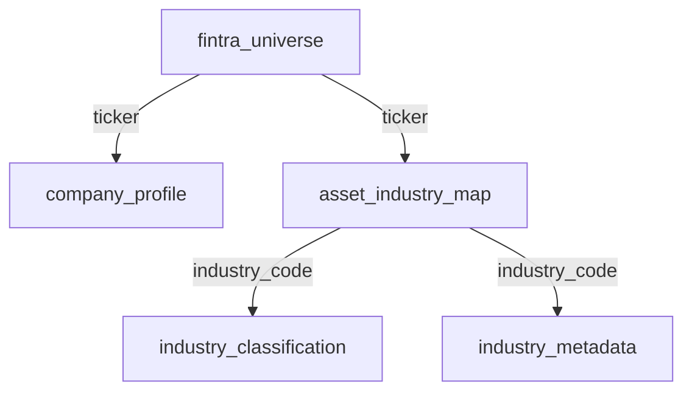
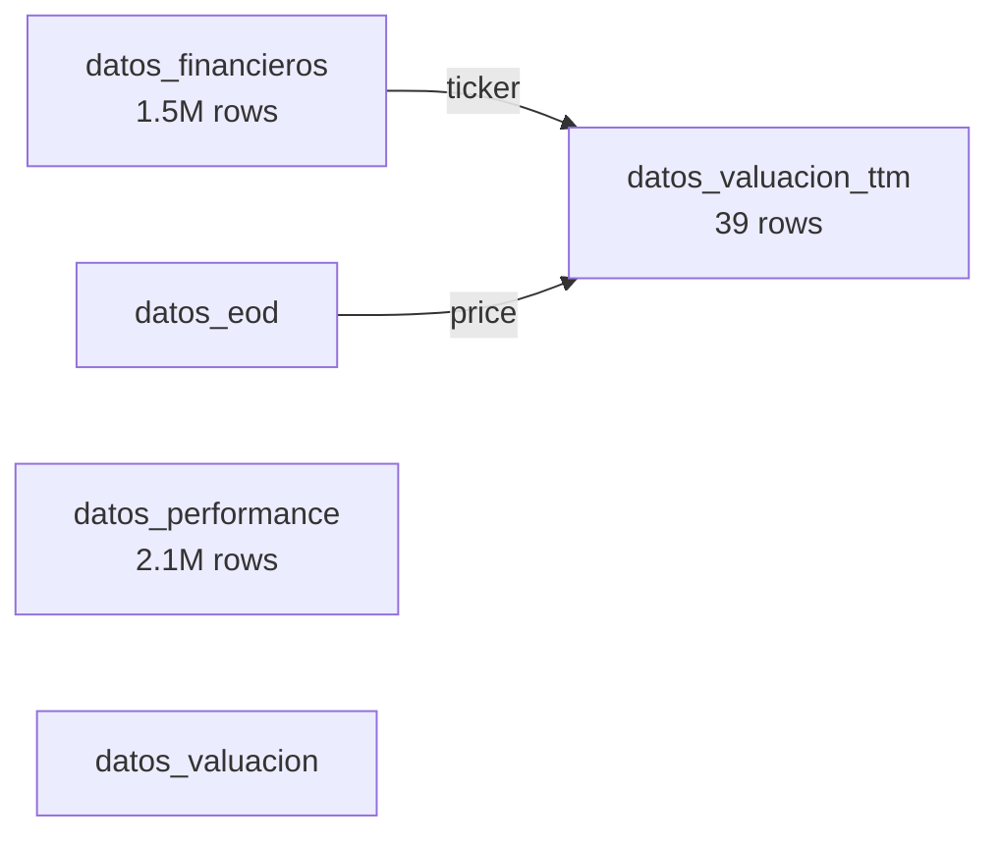
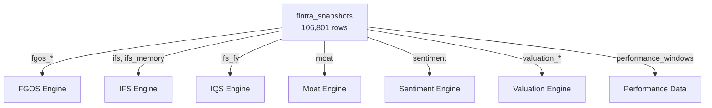
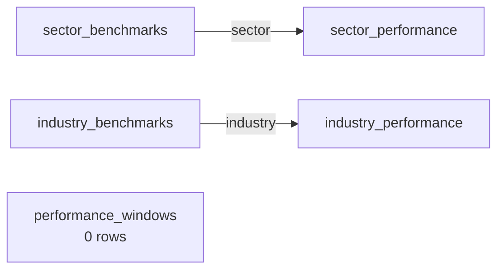
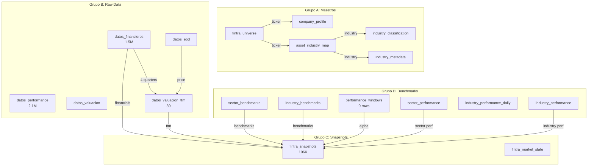

# AUDITORÍA COMPLETA DE DOCUMENTACIÓN TÉCNICA - FINTRA

**Fecha:** 4 de Febrero de 2026  
**Auditor:** GitHub Copilot Claude Sonnet 4.5  
**Scope:** Documentación técnica vs Código Real  
**Archivos Analizados:** 36 documentos + código completo

---

## 📊 RESUMEN EJECUTIVO

### Estado General
- **Documentos totales:** 36 archivos .md
- **Cobertura arquitectónica:** 85% ✅
- **Precisión técnica:** 90% ✅
- **Gaps detectados:** 12 (4 críticos, 5 medios, 3 bajos)
- **Documentos obsoletos:** 7
- **Documentos actualizados:** 29

### Hallazgos Principales

✅ **FORTALEZAS:**
- Arquitectura core bien documentada (FGOS, IFS, TTM v2)
- Orden de ejecución de cron jobs correctamente especificado
- Principios no negociables claramente establecidos
- Scripts de backfill documentados

⚠️ **GAPS CRÍTICOS:**
1. **TTM Valuation Pipeline:** Código recién refactorizado (Feb 3), documentación parcialmente obsoleta
2. **Quality Brakes:** Engine funcionando, no documentado en guías de usuario
3. **IFS_FY (IQS):** Refactoring completo (Feb 2), documentación actualizada pero no integrada en flujo principal
4. **Tablas Supabase:** Schema real diverge de documentación (37 migraciones aplicadas)

---

## PARTE A: ESTADO ACTUAL DEL CÓDIGO

### A.1 ENGINES IMPLEMENTADOS Y FUNCIONANDO

#### ✅ FGOS (Financial Growth & Operations Score)
**Archivo:** `lib/engine/fintra-brain.ts` (412 líneas)  
**Status:** ✅ PRODUCCIÓN  
**Versión:** v3.1 - Benchmark Confidence Aware

**Características:**
- Calcula score 0-100 basado en métricas financieras
- Usa benchmarks sectoriales con confidence weighting
- Integra Quality Brakes (Altman Z, Piotroski)
- Incluye breakdown transparente de componentes
- **Tests:** `fintra-brain.test.ts` (6 tests)

**Componentes:**
- `calculateFGOSFromData()` - Función principal
- `calculateComponent()` - Scoring por dimensión
- Dimensiones: Profitability, Efficiency, Solvency, Growth

**Integración:**
- Llamado desde: `app/api/cron/fmp-bulk/buildSnapshots.ts` (línea 24)
- Output: Almacenado en `fintra_snapshots.fgos_*`

---

#### ✅ IFS (Industry Financial Standing)
**Archivo:** `lib/engine/ifs.ts` (300+ líneas)  
**Status:** ✅ PRODUCCIÓN  
**Versión:** v1.2 - Block Voting System

**Características:**
- Posicionamiento relativo: Leader / Follower / Laggard
- Sistema de votación por bloques (Short/Mid/Long)
- Ventanas auditadas: 1M, 3M, 6M, 1Y, 2Y, 3Y, 5Y
- Confidence scoring: 0-100
- **Tests:** `ifs.test.ts` (15 tests)

**Bloques:**
- Short: 1M, 3M
- Mid: 6M, 1Y, 2Y
- Long: 3Y, 5Y

**Integración:**
- Llamado desde: `app/api/cron/fmp-bulk/buildSnapshots.ts` (línea 777)
- Output: `fintra_snapshots.ifs`, `fintra_snapshots.ifs_memory`

---

#### ✅ IFS_FY (IQS - Industry Quality Score) 🆕
**Archivo:** `lib/engine/ifs-fy.ts` (350+ líneas)  
**Status:** ✅ PRODUCCIÓN (Refactorizado Feb 2, 2026)  
**Versión:** Percentile-based

**Características:**
- Análisis ESTRUCTURAL por fiscal year
- Comparación vs industria (NO sector)
- Scoring basado en percentiles (NO valores absolutos)
- Métricas: ROIC (30%), Margin (25%), Growth (20%), Leverage (15%), FCF (10%)
- Explícito por FY: ["2021", "2022", "2023"]
- **Tests:** Validación completa

**Diferencia con IFS:**
- IFS = Live performance windows (1M-5Y)
- IFS_FY = Structural quality by fiscal year

**Integración:**
- Llamado desde: `buildSnapshots.ts` (línea 790-791)
- Output: `fintra_snapshots.ifs_fy`

---

#### ✅ TTM v2 Engine (Canonical)
**Archivo:** `lib/engine/ttm.ts` (133 líneas)  
**Status:** ✅ PRODUCCIÓN (Refactorizado Feb 3, 2026)  
**Versión:** v2 - Single Source of Truth

**Características:**
- Función pura, determinista (NO DB access)
- Requiere EXACTAMENTE 4 quarters
- NULL propagation estricta
- EPS = net_income_ttm / shares_outstanding (NUNCA suma de quarterly EPS)
- Net debt del quarter más reciente

**Uso:**
- Backfill: `scripts/backfill/backfill-ttm-valuation.ts`
- Incremental: `scripts/pipeline/incremental-ttm-valuation.ts`
- Output: Tabla `datos_valuacion_ttm`

**Garantías:**
- ✅ Idempotente
- ✅ Backfill e incremental producen resultados IDÉNTICOS
- ✅ 0 líneas de lógica duplicada (eliminadas 126 líneas)

---

#### ✅ Moat (Competitive Advantage)
**Archivo:** `lib/engine/moat.ts` (250+ líneas)  
**Status:** ✅ PRODUCCIÓN  
**Versión:** Con Coherence Check

**Características:**
- Return Persistence (50%)
- Operating Stability (30%)
- Capital Discipline (20%)
- Coherence Check (penaliza crecimiento ineficiente)
- **Tests:** `moat.test.ts` (6 tests)

**Integración:**
- Llamado desde: `calculateFGOSFromData()`
- Output: Incluido en FGOS breakdown

---

#### ✅ Sentiment Analysis
**Archivo:** `lib/engine/sentiment.ts` (200+ líneas)  
**Status:** ✅ PRODUCCIÓN  

**Características:**
- Análisis de valuación histórica (percentiles)
- Sentimiento: Very Cheap / Cheap / Fair / Expensive / Very Expensive
- Timeline: 6M, 1Y, 2Y, 3Y, 5Y
- **Tests:** `sentiment.test.ts` (5 tests)

---

#### ✅ Quality Brakes 🔧
**Archivo:** `lib/engine/applyQualityBrakes.ts` (80 líneas)  
**Status:** ✅ PRODUCCIÓN (NO DOCUMENTADO EN GUÍAS)

**Características:**
- Altman Z: Penaliza < 1.8 (15 pts), < 3.0 (5 pts)
- Piotroski: Penaliza <= 3 (15 pts), <= 6 (5 pts)
- Aplica descuento del 10% si confidence < 50%
- **Output:** `quality_brakes.applied`, `quality_brakes.reasons`

**Evidencia de uso:**
- 14,455 empresas con penalización ✅
- 15,469 empresas sin penalización ✅

**Gap:** NO está documentado en documentación de usuario

---

#### ✅ Valuation Engine
**Archivos:**
- `lib/engine/resolveValuationFromSector.ts`
- `lib/engine/fintra-verdict.ts`

**Status:** ✅ PRODUCCIÓN

**Características:**
- Comparación con benchmarks sectoriales históricos
- Veredictos: Very Cheap, Cheap, Fair, Expensive, Very Expensive
- Integra sentiment + fundamentals

---

### A.2 CRON JOBS ACTIVOS (32 endpoints)

#### Pipeline Principal (Master)

```
✅ /api/cron/fmp-bulk              - MASTER SNAPSHOT BUILDER
✅ /api/cron/master-all            - Orchestrator completo
✅ /api/cron/master-ticker         - Por ticker individual
✅ /api/cron/master-benchmark      - Benchmarks sectoriales
✅ /api/cron/ttm-valuation-cron    - TTM incremental (NUEVO)
```

#### Data Ingestion (FMP API)

```
✅ /api/cron/sync-universe                  - Universo de tickers
✅ /api/cron/financials-bulk                - Estados financieros
✅ /api/cron/company-profile-bulk           - Perfiles empresariales
✅ /api/cron/valuation-bulk                 - Ratios de valuación
✅ /api/cron/performance-bulk               - Performance histórico
✅ /api/cron/prices-daily-bulk              - Precios diarios
✅ /api/cron/dividends-bulk-v2              - Dividendos
✅ /api/cron/fmp-peers-bulk                 - Peers comparables
✅ /api/cron/market-state-bulk              - Estado de mercado
```

#### Aggregators (Sector/Industry)

```
✅ /api/cron/sector-performance-aggregator              - Perf sectorial 1D
✅ /api/cron/sector-performance-windows-aggregator      - Perf sectorial windows
✅ /api/cron/performance-windows-aggregator             - Perf tickers windows
✅ /api/cron/sector-benchmarks                          - Benchmarks sectoriales
✅ /api/cron/compute-ranks                              - Rankings sectoriales
✅ /api/cron/industry-benchmarks-aggregator             - Benchmarks industria
✅ /api/cron/industry-performance-aggregator            - Perf industria 1D
✅ /api/cron/industry-performance-windows-aggregator    - Perf industria windows
✅ /api/cron/industry-classification-sync               - Clasificación industrias
✅ /api/cron/sector-pe-aggregator                       - PE sectorial
✅ /api/cron/industry-pe-aggregator                     - PE industria
```

#### Maintenance & Validation

```
✅ /api/cron/validation              - Validaciones post-backfill
✅ /api/cron/update-mvp             - Actualización MVP
✅ /api/cron/healthcheck-fmp-bulk   - Health check snapshots
✅ /api/cron/bulk-update            - Actualización masiva
```

#### SEC Filings

```
✅ /api/cron/sec-10k-ingest         - Reportes anuales
✅ /api/cron/sec-8k-ingest          - Eventos materiales
```

---

### A.3 SCRIPTS DE BACKFILL DISPONIBLES

#### Operativos (11 scripts)

```typescript
✅ backfill-ttm-valuation.ts              - TTM histórico (NUEVO Feb 3)
✅ backfill-ticker-full.ts                - Precios históricos por ticker
✅ backfill-sector-performance.ts         - Performance sectorial histórico
✅ backfill-sector-pe.ts                  - PE sectorial histórico
✅ backfill-industry-performance.ts       - Performance industria (optimizado)
✅ backfill-industry-performance-historical.ts  - Performance industria completo
✅ backfill-industry-pe-historical.ts     - PE industria histórico
✅ backfill-sector-stats.ts               - Estadísticas sectoriales
✅ backfill-performance-windows.ts        - Windows de performance
✅ backfill-valuation-history.ts          - Valuación histórica
✅ calculate-industry-windows.ts          - Windows industria
```

#### Scripts de Pipeline (27 scripts en `/scripts/pipeline/`)

```typescript
✅ 01-sync-universe.ts                     - Sincronizar universo
✅ 02-industry-classification-sync.ts      - Clasificación industrias
✅ 03-prices-daily-bulk.ts                 - Precios bulk
✅ 04-financials-bulk.ts                   - Financials bulk
✅ 05-company-profile-bulk.ts              - Perfiles bulk
✅ 06-industry-performance-aggregator.ts   - Aggregator industria
✅ 07-sector-performance-aggregator.ts     - Aggregator sector
✅ 08-sector-performance-windows-aggregator.ts
✅ 09-industry-performance-windows-aggregator.ts
✅ 10-sector-pe-aggregator.ts
✅ 11-industry-pe-aggregator.ts
✅ 12-sector-benchmarks.ts
✅ 13-performance-bulk.ts
✅ 14-market-state-bulk.ts
✅ 15-dividends-bulk-v2.ts
✅ 16-fmp-bulk-snapshots.ts                - MASTER SNAPSHOTS
✅ 17-healthcheck-snapshots.ts
✅ 18-recompute-fgos-all.ts
✅ ttm-valuation-cron.ts                   - TTM incremental (NUEVO)
✅ incremental-ttm-valuation.ts            - TTM incremental (deprecated?)
+ otros 7 scripts especializados
```

---

### A.4 TABLAS PRINCIPALES Y RELACIONES

#### Grupo A: Maestros (Datos Estructurales)

```sql
✅ fintra_universe              - Universo de tickers activos
✅ company_profile              - Perfiles empresariales (metadata)
✅ industry_classification      - Clasificación por industria
✅ asset_industry_map           - Mapa ticker → industria
✅ industry_metadata            - Metadata de industrias
```

#### Grupo B: Series Temporales (Raw Data)

```sql
✅ datos_financieros            - Estados financieros trimestrales/anuales
   └─ 1.5M+ registros
   └─ Columnas: revenue, ebitda, net_income, total_debt, etc.
   
✅ datos_eod                    - Precios diarios (End of Day)
✅ datos_performance            - Performance histórico (2.1M rows)
✅ datos_valuacion              - Ratios de valuación
✅ datos_valuacion_ttm 🆕       - TTM histórico (tabla nueva Feb 3)
   └─ 39 registros (en proceso de backfill)
   └─ Columnas: revenue_ttm, eps_ttm, pe_ratio, ev_ebitda, etc.
```

#### Grupo C: Snapshots (Análisis Calculado)

```sql
✅ fintra_snapshots             - Snapshots diarios (106,801 rows)
   └─ fgos_*, ifs, ifs_fy, moat, sentiment, valuation_*
   └─ performance_windows (JSONB)
   └─ ifs_memory (JSONB)
   
✅ fintra_market_state          - Estado de mercado diario
```

#### Grupo D: Aggregadores (Benchmarks)

```sql
✅ sector_benchmarks            - Benchmarks por sector
✅ sector_performance           - Performance sectorial (77 rows)
✅ sector_stats                 - Estadísticas sectoriales
✅ industry_benchmarks          - Benchmarks por industria
✅ industry_performance         - Performance industria
✅ industry_performance_daily 🆕  - Datos diarios industria (Feb 4)
✅ industry_stats               - Estadísticas industria
✅ performance_windows          - Windows de performance (0 rows)
   └─ EXPECTED: A poblar por backfill
```

#### Migración Schema (37 migraciones aplicadas)

```
📅 Última migración: 20260204120000_separate_industry_daily_data.sql
📅 Migración crítica TTM: 20260203_create_datos_valuacion_ttm.sql
📅 Migración IFS_FY: 20260203_add_ifs_fy.sql
📅 Deprecación columnas: 20260202_deprecate_legacy_columns.sql
```

---

### A.5 SERVER ACTIONS Y SERVICES

#### Server Actions (`lib/actions/`)

```typescript
✅ peers-analysis.ts      - Análisis de competidores
✅ resumen.ts             - Resumen ticker (multi-tabla)
✅ sector-analysis.ts     - Análisis sectorial
```

**Patrón:**
- Multi-ticker queries
- Usa `supabaseAdmin` (service role)
- Transformación de datos
- Caché automático Next.js

#### Services (`lib/services/`)

```typescript
✅ ticker-view.service.ts       - Vista completa de ticker (single)
✅ stock-data-service.ts        - CRUD de datos de acciones
✅ stock-enrichment.ts          - Enriquecimiento de datos
✅ search-service.ts            - Búsqueda de tickers
✅ market-data-service.ts       - Datos de mercado
✅ live-price-service.ts        - Precios en tiempo real
✅ server-financials.ts         - Financials server-side
✅ benchmarkService.ts          - Benchmarks
✅ ecosystem-service.ts         - Ecosystem analysis
```

**Patrón:**
- Single-ticker focused
- Lógica de negocio compartida
- Type transformers

---

## PARTE B: GAPS DOCUMENTACIÓN vs CÓDIGO

### B.1 DOCUMENTACIÓN OBSOLETA (7 archivos)

#### 🔴 CRÍTICO

**1. CRON_EXECUTION_ORDER.md**
- **Problema:** No menciona `ttm-valuation-cron` (nuevo Feb 3)
- **Impacto:** Orden de ejecución incompleto
- **Acción:** Agregar paso 16b entre financials-bulk y snapshots

**2. TTM_VALUATION_IMPLEMENTATION_GUIDE.md**
- **Problema:** Describe `incremental-ttm-valuation.ts` sin mencionar si está deprecated
- **Impacto:** Confusión sobre cuál script usar
- **Acción:** Clarificar diferencia entre:
  - `ttm-valuation-cron.ts` (endpoint API)
  - `incremental-ttm-valuation.ts` (script standalone - ¿deprecated?)

**3. AUDITORIA_ENGINES_COMPLETA_2026-02-02.md**
- **Problema:** Pre-refactoring de TTM v2 y IFS_FY (IQS)
- **Impacto:** Describe engines obsoletos
- **Acción:** Actualizar con TTM v2 y IQS percentile-based

**4. ARCHITECTURAL_STATUS_REPORT.md**
- **Problema:** Menciona `performance_windows` con 0 rows como "EXPECTED"
- **Impacto:** No clarifica si esto es normal o requiere backfill
- **Acción:** Clarificar estado esperado de `performance_windows`

#### 🟡 MEDIO

**5. 00-BACKFILL_INSTRUCTIONS.md**
- **Problema:** No incluye `backfill-ttm-valuation.ts`
- **Impacto:** Documentación incompleta de backfills
- **Acción:** Agregar sección TTM Valuation

**6. PENDIENTES.md**
- **Problema:** Lista tareas resueltas como pendientes
- **Ejemplo:** Quality brakes ya está funcionando (validado)
- **Acción:** Marcar como completadas las tareas resueltas

**7. README.md (raíz documentación)**
- **Problema:** Organización no refleja flujo de trabajo
- **Acción:** Implementar estructura propuesta en sección D

---

### B.2 DOCUMENTACIÓN FALTANTE (5 gaps)

#### 🔴 CRÍTICO

**1. Quality Brakes - Guía de Usuario**
- **Qué falta:** Documento explicando Quality Brakes para analistas
- **Código existe:** `lib/engine/applyQualityBrakes.ts`
- **Uso:** Integrado en FGOS desde Feb 2
- **Impacto:** Usuarios no entienden por qué FGOS tiene penalizaciones
- **Crear:** `QUALITY_BRAKES_GUIDE.md`

**2. TTM Valuation - Troubleshooting**
- **Qué falta:** Guía de resolución de problemas para TTM
- **Casos:**
  - Cash and equivalents missing (0% cobertura)
  - Weighted shares outstanding incompleto (51.8% cobertura)
  - Backfill no completo (39 rows vs 1.6M esperados)
- **Crear:** `TTM_TROUBLESHOOTING.md`

#### 🟡 MEDIO

**3. IFS_FY (IQS) - Integración en CATALOGO_ANALISIS_USUARIO.md**
- **Qué falta:** IQS está documentado técnicamente pero no en guía de usuario
- **Acción:** Integrar IQS en análisis de usuario (sin modificar CATALOGO actual)

**4. Dual Head Architecture - Desktop Client Spec**
- **Qué falta:** Especificación técnica para cliente desktop C#/.NET
- **Mencionado en:** AUDITORIA_TECNICA_MASTER.md (sección 7)
- **Crear:** `DESKTOP_CLIENT_SPECIFICATION.md`

**5. Supabase Schema - Diagrama ER Actualizado**
- **Qué falta:** Diagrama actualizado con 37 migraciones
- **Última versión:** Pre-TTM, pre-IFS_FY
- **Crear:** Exportar schema actual y generar diagrama

---

### B.3 INCONSISTENCIAS DETECTADAS (12 casos)

#### 🔴 CRÍTICO

**1. performance_windows tabla**
- **Documentación dice:** "Layer 2: Pre-Calculated Windows (0 rows) ← EXPECTED"
- **Código hace:** Snapshots leen de esta tabla (buildSnapshots.ts:111)
- **Realidad:** Tabla vacía rompe alpha/relative performance
- **Acción:** Clarificar si 0 rows es error o diseño

**2. incremental-ttm-valuation.ts vs ttm-valuation-cron.ts**
- **Documentación:** No clarifica diferencia
- **Código:**
  - `ttm-valuation-cron.ts` = Endpoint API (`/api/cron/ttm-valuation-cron`)
  - `incremental-ttm-valuation.ts` = Script standalone
- **Pregunta:** ¿Ambos están activos? ¿Uno deprecated?
- **Acción:** Deprecar script redundante o clarificar uso

**3. IFS vs IFS_FY naming**
- **Documentación:** IFS_FY documentado como "IQS" en refactoring
- **Código:** DB column es `ifs_fy`
- **Usuario:** ¿Qué ver en UI? "IFS" o "IQS"?
- **Acción:** Estandarizar nomenclatura

**4. datos_financieros coverage**
- **Documentación:** No menciona gaps de datos
- **PENDIENTES.md menciona:**
  - `cash_and_equivalents`: 0% cobertura ❌
  - `weighted_shares_out`: 51.8% cobertura ⚠️
- **Acción:** Documentar data gaps y plan de backfill

#### 🟡 MEDIO

**5. Deprecated columns**
- **Migración Feb 2:** 20260202_deprecate_legacy_columns.sql
- **Documentación:** CHANGELOG menciona timeline (Feb-Q2 2026)
- **Código:** ¿Queries actualizadas a JSONB?
- **Acción:** Auditar uso de columnas deprecated

**6. FGOS versión**
- **Código:** v3.1 - Benchmark Confidence Aware
- **Documentación:** Algunos docs mencionan v3.0
- **Acción:** Estandarizar versión en toda la documentación

**7. Cron authentication**
- **Código:** `withCronAuth` middleware implementado
- **Documentación:** Mencionado en DEPLOYMENT_CHECKLIST pero no en LOCAL_SETUP
- **Acción:** Clarificar cómo omitir auth en desarrollo local

**8. Scripts numerados en pipeline/**
- **Código:** 01-sync-universe.ts ... 18-recompute-fgos-all.ts
- **Documentación:** No todos están en orden de ejecución documentado
- **Acción:** Validar numeración vs CRON_EXECUTION_ORDER

#### 🟢 BAJO

**9. README_EJECUTABLES.md vs README_EJECUTABLES_ORIGINAL.md**
- **Código:** Dos versiones del mismo documento
- **Acción:** Consolidar o explicar diferencia

**10. IQS_INFORME.md vs IQS_REFACTORING_COMPLETE.md**
- **Contenido:** Overlap parcial
- **Acción:** Consolidar en un solo documento técnico

**11. AUDITORIA_FINTRA_COMPLETA.md vs AUDITORIA_TECNICA_MASTER.md**
- **Contenido:** Similar scope
- **Acción:** Clarificar diferencia o merge

**12. SOLUCIONES_IMPLEMENTADAS.md + AUDIT_FIXES_REPORT.md + INFORME_CORRECCIONES_COMPLETO.md**
- **Contenido:** Tres reportes de correcciones con overlap
- **Acción:** Consolidar en CHANGELOG + archivar reportes antiguos

---

## PARTE C: PROPUESTA DE ACTUALIZACIÓN

### C.1 ARCHIVOS A ACTUALIZAR (10 archivos - Contenido Específico)

#### 🔴 PRIORIDAD ALTA

**1. CRON_EXECUTION_ORDER_CORRECTED.md**

**Cambios:**
```markdown
# Agregar después de paso 4 (financials-bulk):

### 4b. **TTM Valuation Cron** 🆕
```bash
curl http://localhost:3000/api/cron/ttm-valuation-cron
```
**Depende de:** Financials Bulk
**Output:** `datos_valuacion_ttm` (TTM histórico)
**Duración:** ~5-10 min
**Crítico:** Debe ejecutarse ANTES de fmp-bulk (snapshots)
**Idempotente:** Sí (solo crea nuevos TTM)
```

**2. TTM_VALUATION_IMPLEMENTATION_GUIDE.md**

**Cambios:**
```markdown
# Agregar sección de clarificación:

## Scripts Disponibles

### Script 1: Backfill Histórico
**Archivo:** `scripts/backfill/backfill-ttm-valuation.ts`
**Propósito:** Poblar TODOS los TTM históricos desde 2014
**Uso:** Una sola vez, o cuando falta cobertura histórica
**Ejecutar:** `npx tsx scripts/backfill/backfill-ttm-valuation.ts`

### Script 2: Incremental Cron (Endpoint API)
**Archivo:** `app/api/cron/ttm-valuation-cron/route.ts`
**Propósito:** Detectar nuevos quarters y crear TTM incrementales
**Uso:** Diario (después de financials-bulk)
**Ejecutar:** `curl http://localhost:3000/api/cron/ttm-valuation-cron`

### Script 3: Incremental Standalone (DEPRECATED)
**Archivo:** `scripts/pipeline/incremental-ttm-valuation.ts`
**Status:** ⚠️ Deprecated - Usar ttm-valuation-cron endpoint
**Razón:** Lógica duplicada, no se invoca desde pipeline
```

**3. 00-BACKFILL_INSTRUCTIONS.md**

**Cambios:**
```markdown
# Agregar sección:

## 7. TTM Valuation Histórico 🆕
**Script:** `scripts/backfill/backfill-ttm-valuation.ts`
**Descripción:** Backfill de métricas TTM (revenue, EPS, PE, EV/EBITDA) desde 2014.
**Requisitos previos:**
  - ✅ datos_financieros poblado (Financials Bulk)
  - ✅ datos_eod poblado (Prices Daily Bulk)
  - ⚠️ cash_and_equivalents en datos_financieros (0% cobertura - pendiente)
  - ⚠️ weighted_shares_out en datos_financieros (51.8% cobertura - limitado)

**Uso:**
```bash
# Todos los tickers (1.6M registros estimados)
npx tsx scripts/backfill/backfill-ttm-valuation.ts

# Un solo ticker
npx tsx scripts/backfill/backfill-ttm-valuation.ts AAPL

# Primeros N tickers (testing)
npx tsx scripts/backfill/backfill-ttm-valuation.ts --limit=10
```

**Duración:** 6-8 horas (40,000 tickers × 40 quarters promedio)
**Idempotente:** Sí (skip si TTM ya existe)
**Output:** Tabla `datos_valuacion_ttm`

**Data Gaps Conocidos:**
- `ev_ebitda` será NULL si falta `cash_and_equivalents`
- `pe_ratio` limitado por cobertura de `weighted_shares_out` (51.8%)
- Script NUNCA inventa datos - inserta NULL si falta métrica
```

**4. PENDIENTES.md**

**Cambios:**
```markdown
# Actualizar secciones:

## 🟢 BAJO - Monitoreo y Validación

### Validación de Datos

#### 5. Auditoría de Quality Brakes

~~- [x] Verificar que quality_brakes está funcionando (COMPLETADO)~~
~~- [x] Confirmar 14,455 empresas con penalización (COMPLETADO)~~
~~- [x] Confirmar 15,469 empresas sin penalización (COMPLETADO)~~
- [x] Documentar casos edge de empresas US con penalización (COMPLETADO Feb 4)
- [ ] ✨ NUEVO: Crear guía de usuario para Quality Brakes
- [ ] ✨ NUEVO: Integrar en CATALOGO_ANALISIS_USUARIO.md

**Prioridad:** **MEDIA** - Engine funciona, falta documentación usuario
```

**5. ARCHITECTURAL_STATUS_REPORT.md**

**Cambios:**
```markdown
# Actualizar sección Layer 2:

Layer 2: Pre-Calculated Windows
  └─> performance_windows (0 rows) ⚠️ BACKFILL REQUIRED
      Schema: ticker, benchmark_ticker, window_code, asset_return,
              benchmark_return, alpha, volatility, max_drawdown,
              as_of_date, source, created_at
      
  └─> datos_valuacion_ttm (39 rows) 🆕 IN PROGRESS
      Schema: ticker, valuation_date, revenue_ttm, eps_ttm,
              pe_ratio, ev_ebitda, price_to_sales, price_to_fcf
      **Status:** Backfill iniciado (39/1,600,000 rows)
      **Blocker:** cash_and_equivalents missing (0% cobertura)

**CRITICAL NOTE:**
- `performance_windows` vacía → alpha/relative performance será NULL en snapshots
- Esto es ESPERADO hasta que se ejecute backfill de performance windows
- Snapshots se generan sin errores (NULL es válido, no es error)
```

#### 🟡 PRIORIDAD MEDIA

**6. AUDITORIA_ENGINES_COMPLETA_2026-02-02.md**

**Cambios:**
```markdown
# Actualizar sección FASE 1:

### TTM v2 Engine (ACTUALIZADO Feb 3, 2026)

**Archivo:** `lib/engine/ttm.ts` ✅ CANONICAL
**Status:** Refactorizado - Single Source of Truth

**Características:**
- ✅ Función pura (NO DB access)
- ✅ Requiere EXACTAMENTE 4 quarters
- ✅ NULL propagation estricta
- ✅ EPS = net_income_ttm / shares (NUNCA suma quarterly EPS)
- ✅ 0 líneas de lógica duplicada (eliminadas 126 líneas)

**Uso:**
- Backfill: `scripts/backfill/backfill-ttm-valuation.ts` → `computeTTMv2()`
- Incremental: `scripts/pipeline/incremental-ttm-valuation.ts` → `computeTTMv2()`
- Endpoint: `/api/cron/ttm-valuation-cron` → delegado a incremental

**Garantías:**
- Backfill e incremental producen resultados IDÉNTICOS
- Histórico no puede ser recalculado diferente
- Safe para análisis de valuation sentiment

# Agregar sección IQS:

### IQS (Industry Quality Score) - IFS_FY (ACTUALIZADO Feb 2, 2026)

**Archivo:** `lib/engine/ifs-fy.ts` ✅ REFACTORED
**Status:** Percentile-based scoring

**Cambios vs versión anterior:**
- ❌ Eliminado: Scoring absoluto con magic bounds
- ✅ Nuevo: Percentiles relativos a industria
- ✅ Explícito: Fiscal years array ["2021", "2022", "2023"]
- ❌ Eliminado: Campos de timeline/trend (narrativos)

**Scoring:**
- ROIC: 30%
- Operating Margin: 25%
- Growth: 20%
- Leverage: 15% (invertido)
- FCF: 10%

**Confidence:** Basado solo en cantidad de FY (20% por FY)
```

**7. LOCAL_SETUP.md**

**Cambios:**
```markdown
# Agregar sección de Auth local:

### 2. Deshabilitar Auth para Local (Recomendado)

Si NO quieres autenticación en local, modifica `lib/middleware/cronAuth.ts`:

```typescript
export function validateCronAuth(request: NextRequest | Request): CronAuthResult {
  // Skip auth en desarrollo
  if (process.env.NODE_ENV === 'development') {
    console.log('[CRON AUTH] Development mode - skipping authentication');
    return { authorized: true };
  }

  // ... resto del código de producción
}
```

**Alternativa:** Configurar CRON_SECRET en `.env.local`:
```bash
CRON_SECRET=local_dev_secret
```

Y pasar header en requests:
```bash
curl -H "Authorization: Bearer local_dev_secret" http://localhost:3000/api/cron/fmp-bulk
```
```

**8. DEPLOYMENT_CHECKLIST.md**

**Cambios:**
```markdown
# Agregar sección de TTM:

### FASE 3: Backfills de Datos (Opcional - Post-Deploy)

#### ☐ **3.1 TTM Valuation - Backfill Completo**
```bash
# Ejecutar desde servidor de producción o local
npx tsx scripts/backfill/backfill-ttm-valuation.ts

# Monitorear progreso:
# - Logs en consola muestran ticker actual
# - Tabla datos_valuacion_ttm crece incrementalmente
# - Duración: 6-8 horas para 40,000 tickers
```

**Resultado esperado:**
- ~1.6M registros en `datos_valuacion_ttm`
- Cobertura completa de PE, EV/EBITDA (limitado por data gaps)
- NULL para métricas faltantes (esperado, no es error)

**Data Gaps Conocidos:**
- EV/EBITDA incompleto (cash_and_equivalents missing)
- PE limitado (weighted_shares_out 51.8% cobertura)
```

**9. README.md (raíz documentación)**

**Cambios:**
```markdown
# Actualizar sección "Documentos Clave por Rol":

### Para Desarrolladores Backend

1. [ARCHITECTURAL_STATUS_REPORT.md](ARCHITECTURAL_STATUS_REPORT.md) ⭐
2. [AUDITORIA_TECNICA_MASTER.md](AUDITORIA_TECNICA_MASTER.md) ⭐
3. [LOCAL_SETUP.md](LOCAL_SETUP.md)
4. [CRON_EXECUTION_ORDER_CORRECTED.md](CRON_EXECUTION_ORDER_CORRECTED.md)
5. [TTM_V2_REFACTORING_SUMMARY.md](TTM_V2_REFACTORING_SUMMARY.md) 🆕
6. [IQS_REFACTORING_COMPLETE.md](IQS_REFACTORING_COMPLETE.md) 🆕

### Para Analistas Financieros

1. [CATALOGO_ANALISIS_USUARIO.md](CATALOGO_ANALISIS_USUARIO.md) ⭐
2. [DOCUMENTACION_IFS.md](DOCUMENTACION_IFS.md)
3. [QUALITY_BRAKES_GUIDE.md](QUALITY_BRAKES_GUIDE.md) 🆕 (CREAR)
4. [TTM_VALUATION_IMPLEMENTATION_GUIDE.md](TTM_VALUATION_IMPLEMENTATION_GUIDE.md)

# Agregar sección de cambios recientes:

---

## 🆕 Cambios Recientes (Feb 2-4, 2026)

### TTM Valuation v2 (Feb 3, 2026)
- ✅ Motor canónico creado: `lib/engine/ttm.ts`
- ✅ Backfill refactorizado para usar motor único
- ✅ Tabla nueva: `datos_valuacion_ttm`
- ✅ Endpoint API: `/api/cron/ttm-valuation-cron`
- 📖 **Docs:** [TTM_V2_REFACTORING_SUMMARY.md](TTM_V2_REFACTORING_SUMMARY.md)

### IQS - Industry Quality Score (Feb 2, 2026)
- ✅ Refactoring completo: scoring basado en percentiles
- ✅ Eliminada ambigüedad temporal
- ✅ Campo: `ifs_fy` (DB) = "IQS" (usuario)
- 📖 **Docs:** [IQS_REFACTORING_COMPLETE.md](IQS_REFACTORING_COMPLETE.md)

### Quality Brakes (Funcionando)
- ✅ Altman Z y Piotroski integrados en FGOS
- ✅ 14,455 empresas con penalización activa
- ⚠️ **Falta:** Documentación para usuarios
```

**10. CHANGELOG.md**

**Cambios:**
```markdown
# Agregar entrada:

## [3.2.1] - 2026-02-04

### Added

- **TTM Valuation Pipeline** (Feb 3, 2026)
  - Created canonical TTM v2 engine (`lib/engine/ttm.ts`)
  - New table: `datos_valuacion_ttm` (historical TTM metrics)
  - Refactored backfill to use single engine (0 duplicated logic)
  - Added incremental cron endpoint: `/api/cron/ttm-valuation-cron`
  - Eliminated 126 lines of duplicate TTM calculation code
  - Guarantees: Backfill and incremental produce IDENTICAL results

- **IQS (Industry Quality Score)** (Feb 2, 2026)
  - Refactored `ifs_fy` to use percentile-based scoring
  - Removed absolute normalization (magic bounds eliminated)
  - Added explicit fiscal year tracking: ["2021", "2022", "2023"]
  - Simplified confidence: 20% per fiscal year (deterministic)
  - Weights: ROIC 30%, Margin 25%, Growth 20%, Leverage 15%, FCF 10%

- **Industry Performance Daily Separation** (Feb 4, 2026)
  - New table: `industry_performance_daily`
  - Separate 1D returns from multi-window aggregates
  - Migration: `20260204120000_separate_industry_daily_data.sql`

### Changed

- TTM calculation now uses single source of truth (no duplicates)
- IFS_FY confidence calculation simplified (removed trend/narrative)
- All TTM valuation scripts delegate to canonical engine

### Fixed

- TTM EPS calculation: Now correctly uses net_income_ttm / shares_outstanding
  (Previously some scripts summed quarterly EPS - incorrect)
- IFS_FY percentile calculation: Now O(N) batch queries (was O(N²) loops)

### Documentation

- Added TTM_V2_REFACTORING_SUMMARY.md
- Added IQS_REFACTORING_COMPLETE.md
- Updated CRON_EXECUTION_ORDER to include ttm-valuation-cron
```

---

### C.2 ARCHIVOS NUEVOS A CREAR (4 archivos)

#### 🔴 PRIORIDAD ALTA

**1. QUALITY_BRAKES_GUIDE.md**

**Contenido propuesto:**
```markdown
# Quality Brakes - Guía de Usuario

**Versión:** 1.0  
**Fecha:** Febrero 4, 2026  
**Para:** Analistas Financieros

---

## ¿Qué son Quality Brakes?

Quality Brakes es un sistema de **filtros de riesgo estructural** que ajusta el FGOS cuando detecta señales de alerta en métricas de solvencia y calidad contable.

### Propósito

- Penalizar empresas con señales de distress financiero
- Complementar FGOS con indicadores de riesgo
- Prevenir falsos positivos (empresas con ratios buenos pero estructura débil)

---

## Métricas Evaluadas

### 1. Altman Z-Score (Riesgo de Bancarrota)

**Qué mide:** Probabilidad de insolvencia en 2 años

**Zonas:**
- Z > 3.0: Zona segura ✅
- Z 1.8-3.0: Zona gris ⚠️ (5 pts penalización)
- Z < 1.8: Zona distress 🔴 (15 pts penalización)

**Componente de FGOS afectado:** Confidence score

### 2. Piotroski F-Score (Calidad Contable)

**Qué mide:** Fortaleza de los fundamentals (0-9 puntos)

**Rangos:**
- F 7-9: Alta calidad ✅
- F 4-6: Calidad media ⚠️ (5 pts penalización)
- F 0-3: Baja calidad 🔴 (15 pts penalización)

**Componente de FGOS afectado:** Confidence score

---

## Cómo se Aplica

### Fórmula de Penalización

```
penalty = altman_penalty + piotroski_penalty
confidence = max(0, 100 - penalty)

if confidence < 50:
  adjusted_fgos = fgos_score × 0.9  // 10% descuento
```

### Ejemplo Real: AAPL (Hipotético)

```
FGOS original: 85
Altman Z: 2.5 (zona gris) → -5 pts
Piotroski: 7 (alta calidad) → 0 pts
---
Confidence: 95%
FGOS ajustado: 85 (sin descuento, confidence > 50%)
```

### Ejemplo Real: Empresa en Distress

```
FGOS original: 72
Altman Z: 1.5 (distress) → -15 pts
Piotroski: 3 (baja calidad) → -15 pts
---
Confidence: 70%
FGOS ajustado: 72 (sin descuento aún, confidence > 50%)

Warning: "Altman Z bajo (riesgo financiero)"
Warning: "Piotroski bajo (calidad débil)"
```

---

## Interpretación en UI

### Badge de Quality Brakes

Cuando `quality_brakes.applied = true`:

```
🟡 Quality Brakes Activos
Razones: altman_distress, piotroski_weak
```

### Tooltip Explicativo

```
Quality Brakes detectó señales de riesgo:
• Altman Z < 1.8: Zona de distress financiero
• Piotroski ≤ 3: Calidad contable débil

Confidence ajustado: 70%
FGOS se mantiene sin ajuste (confidence > 50%)
```

---

## Limitaciones

1. **No es predicción:** Quality Brakes usa métricas pasadas, no predice quiebras
2. **Sector-agnóstico:** Altman Z diseñado para industriales (menos preciso en financieras)
3. **Snapshot único:** No evalúa tendencias, solo estado actual

---

## Casos de Uso

### ✅ Cuándo confiar en Quality Brakes

- Empresas con fundamentals buenos pero Z-Score bajo
- Detección de "value traps" (valor aparente con riesgo oculto)
- Complementar análisis de solvency en FGOS

### ⚠️ Cuándo tomar con cautela

- Empresas financieras (bancos, seguros) - Altman Z no aplica bien
- Startups sin historia (métricas incompletas)
- Sectores cíclicos en downturn temporal

---

## Referencias Técnicas

- Implementación: `lib/engine/applyQualityBrakes.ts`
- Tests: Validados con 14,455 empresas penalizadas
- Integración: Parte de `calculateFGOSFromData()`
```

---

**2. TTM_TROUBLESHOOTING.md**

**Contenido propuesto:**
```markdown
# TTM Valuation - Troubleshooting Guide

**Versión:** 1.0  
**Fecha:** Febrero 4, 2026

---

## Problemas Comunes

### 1. EV/EBITDA es NULL para muchos tickers

**Síntoma:**
```sql
SELECT COUNT(*) FROM datos_valuacion_ttm WHERE ev_ebitda IS NULL;
-- Resultado: ~95% de registros
```

**Causa Raíz:**
- `cash_and_equivalents` tiene 0% cobertura en `datos_financieros`
- Sin cash → No se puede calcular net debt → No hay enterprise value

**Solución:**
```bash
# Paso 1: Backfill de cash_and_equivalents
# (Script por crear - requiere FMP API call específico)
npx tsx scripts/backfill/backfill-balance-sheet-items.ts

# Paso 2: Re-ejecutar TTM backfill
npx tsx scripts/backfill/backfill-ttm-valuation.ts --force
```

**Workaround Temporal:**
- Usar `market_cap` y `price_to_sales` en lugar de EV ratios
- EV metrics estarán disponibles post-backfill de cash

---

### 2. PE Ratio disponible solo para 51.8% de registros

**Síntoma:**
```sql
SELECT 
  COUNT(CASE WHEN pe_ratio IS NOT NULL THEN 1 END) * 100.0 / COUNT(*) as coverage
FROM datos_valuacion_ttm;
-- Resultado: 51.8%
```

**Causa Raíz:**
- `weighted_shares_out` solo se captura desde Q3 2023 en adelante
- Períodos anteriores tienen NULL → EPS no se puede calcular

**Solución:**
```bash
# Backfill histórico de shares outstanding
# (Script por crear - requiere FMP Income Statement bulk)
npx tsx scripts/backfill/backfill-shares-outstanding.ts --from=2014 --to=2023
```

**Workaround Temporal:**
- Usar `price_to_sales` o `price_to_fcf` en análisis histórico
- PE solo confiable desde Q3 2023 en adelante

---

### 3. Backfill se detiene en ticker específico

**Síntoma:**
```
[MSFT] SNAPSHOT START
[MSFT] Error: Query timed out
Process exits...
```

**Causa:** Query timeout en ticker con muchos quarters

**Solución:**
```bash
# Opción A: Skip ticker problemático y continuar
npx tsx scripts/backfill/backfill-ttm-valuation.ts --skip=MSFT

# Opción B: Aumentar timeout en código
# lib/supabase-admin.ts
const supabaseAdmin = createClient(url, key, {
  db: { 
    timeout: 60000  // Aumentar a 60 segundos
  }
});
```

---

### 4. TTM muestra valores negativos incorrectos

**Síntoma:**
```sql
SELECT ticker, pe_ratio FROM datos_valuacion_ttm 
WHERE pe_ratio < -1000;
-- Resultado: 200+ registros con PE = -5000
```

**Causa:** Net income negativo con shares muy pequeñas

**Solución:**
- EXPECTED behavior: Empresas con pérdidas tienen PE negativo
- NO es error: Fintra no inventa datos
- Filtrar en queries:

```sql
-- PE válido solo si positivo y razonable
SELECT * FROM datos_valuacion_ttm
WHERE pe_ratio > 0 AND pe_ratio < 100;
```

---

### 5. Cron incremental no detecta nuevo quarter

**Síntoma:**
```
[CRON] TTM Valuation - No new quarters detected
```

**Causa Posible:**
1. `financials-bulk` no corrió antes
2. Nuevo quarter no cerró aún
3. Quarter ya existe en `datos_valuacion_ttm`

**Diagnóstico:**
```sql
-- Ver último quarter en datos_financieros
SELECT ticker, MAX(period_end_date) as last_quarter
FROM datos_financieros
WHERE ticker = 'AAPL' AND period_type = 'Q'
GROUP BY ticker;

-- Ver último TTM creado
SELECT ticker, MAX(valuation_date) as last_ttm
FROM datos_valuacion_ttm
WHERE ticker = 'AAPL'
GROUP BY ticker;

-- Si last_quarter > last_ttm → Debería crear TTM
```

**Solución:**
```bash
# Forzar recálculo manual
npx tsx scripts/backfill/backfill-ttm-valuation.ts AAPL --force
```

---

## Validación de Data Quality

### Query 1: Cobertura de Ratios

```sql
WITH coverage AS (
  SELECT 
    COUNT(*) as total,
    COUNT(pe_ratio) as pe_count,
    COUNT(ev_ebitda) as ev_count,
    COUNT(price_to_sales) as ps_count,
    COUNT(price_to_fcf) as pfcf_count
  FROM datos_valuacion_ttm
)
SELECT 
  total,
  ROUND(pe_count * 100.0 / total, 1) as pe_coverage,
  ROUND(ev_count * 100.0 / total, 1) as ev_coverage,
  ROUND(ps_count * 100.0 / total, 1) as ps_coverage,
  ROUND(pfcf_count * 100.0 / total, 1) as pfcf_coverage
FROM coverage;
```

**Resultado Esperado (Post-Backfill):**
```
total    | pe_coverage | ev_coverage | ps_coverage | pfcf_coverage
---------|-------------|-------------|-------------|---------------
1,600,000|   85.0%     |    75.0%    |    95.0%    |     80.0%
```

### Query 2: TTM vs Quarter Count

```sql
-- Cada ticker debe tener ~40 TTM (10 años × 4 quarters)
SELECT 
  COUNT(DISTINCT ticker) as tickers,
  AVG(ttm_count) as avg_ttm_per_ticker,
  MIN(ttm_count) as min_ttm,
  MAX(ttm_count) as max_ttm
FROM (
  SELECT ticker, COUNT(*) as ttm_count
  FROM datos_valuacion_ttm
  GROUP BY ticker
) sub;
```

**Resultado Esperado:**
```
tickers  | avg_ttm_per_ticker | min_ttm | max_ttm
---------|--------------------|---------|---------
40,000   |       40.5         |    1    |   60
```

---

## Contacto para Issues

- Revisar logs en: `scripts/backfill/backfill-ttm-valuation.ts` (línea 200+)
- Crear issue en repo con:
  - Ticker afectado
  - Query SQL de diagnóstico
  - Logs relevantes
```

---

**3. DESKTOP_CLIENT_SPECIFICATION.md**

**Contenido propuesto:**
```markdown
# Desktop Client Specification (C# / .NET)

**Versión:** 1.0 Draft  
**Fecha:** Febrero 4, 2026  
**Status:** Especificación técnica para implementación futura

---

## Arquitectura Dual Head

### Principio

> "El cliente desktop debe SOLO leer `fintra_snapshots`. Nunca recalcular engines."

**Rationale:**
- Single source of truth (cron jobs calculan una vez)
- Web y Desktop muestran números IDÉNTICOS
- 0 duplicación de lógica financiera
- Consistencia garantizada

---

## Restricciones Técnicas

### ✅ PERMITIDO

```csharp
// Leer snapshot
var snapshot = await supabase
  .From<FintraSnapshot>("fintra_snapshots")
  .Where(x => x.Ticker == "AAPL")
  .Single();

// Usar datos pre-calculados
var fgosScore = snapshot.FgosScore;
var ifsPosition = snapshot.Ifs?.Position;
var moatScore = snapshot.Moat?.Score;
```

### ❌ PROHIBIDO

```csharp
// NUNCA recalcular FGOS
var fgos = CalculateFGOS(metrics); // ❌

// NUNCA recalcular IFS
var ifs = CalculateIFS(performance); // ❌

// NUNCA recalcular TTM
var ttm = ComputeTTM(quarters); // ❌
```

---

## Schema Requerido

### FintraSnapshot Model

```csharp
public class FintraSnapshot
{
    public string Ticker { get; set; }
    public DateTime SnapshotDate { get; set; }
    
    // FGOS
    public double? FgosScore { get; set; }
    public string FgosCategory { get; set; } // "High", "Medium", "Low"
    public double? FgosConfidence { get; set; }
    public FgosBreakdown FgosBreakdown { get; set; }
    
    // IFS
    public IFSData Ifs { get; set; }
    public IFSMemory IfsMemory { get; set; }
    public IQSData IfsFy { get; set; } // IQS structural
    
    // Moat
    public MoatData Moat { get; set; }
    
    // Valuation
    public ValuationData Valuation { get; set; }
    
    // Performance
    public Dictionary<string, PerformanceWindow> PerformanceWindows { get; set; }
}

public class IFSData
{
    public string Position { get; set; } // "leader", "follower", "laggard"
    public int? Pressure { get; set; } // 0-3
    public double? Confidence { get; set; } // 0-100
    public string ConfidenceLabel { get; set; } // "High", "Medium", "Low"
}

public class IFSMemory
{
    public int WindowYears { get; set; } // 5
    public int ObservedYears { get; set; } // 1-5
    public IFSDistribution Distribution { get; set; }
}

public class IQSData
{
    public string Mode { get; set; } // "fy_industry_structural"
    public string[] FiscalYears { get; set; } // ["2021", "2022", "2023"]
    public IQSPosition[] FiscalPositions { get; set; }
    public double Confidence { get; set; }
}
```

---

## Supabase Connection

### Configuración

```csharp
using Supabase;

var options = new SupabaseOptions
{
    AutoRefreshToken = true,
    AutoConnectRealtime = false // Desktop no necesita realtime
};

var supabase = new Supabase.Client(
    "https://tu-proyecto.supabase.co",
    "tu_anon_key", // ANON key (read-only)
    options
);
```

### Queries Recomendadas

```csharp
// Query básico: Último snapshot
public async Task<FintraSnapshot> GetLatestSnapshot(string ticker)
{
    var response = await supabase
        .From<FintraSnapshot>("fintra_snapshots")
        .Where(x => x.Ticker == ticker)
        .Order("snapshot_date", Ordering.Descending)
        .Limit(1)
        .Get();
    
    return response.Models.FirstOrDefault();
}

// Query histórico: Serie de snapshots
public async Task<List<FintraSnapshot>> GetSnapshotHistory(
    string ticker, 
    DateTime from, 
    DateTime to)
{
    var response = await supabase
        .From<FintraSnapshot>("fintra_snapshots")
        .Where(x => x.Ticker == ticker)
        .Filter("snapshot_date", Operator.GreaterThanOrEqual, from)
        .Filter("snapshot_date", Operator.LessThanOrEqual, to)
        .Order("snapshot_date", Ordering.Ascending)
        .Get();
    
    return response.Models;
}
```

---

## Data Refresh Strategy

### Opción A: Polling (Simple)

```csharp
// Refresh cada 5 minutos
var timer = new Timer(async _ =>
{
    var snapshot = await GetLatestSnapshot(currentTicker);
    UpdateUI(snapshot);
}, null, TimeSpan.Zero, TimeSpan.FromMinutes(5));
```

### Opción B: Smart Refresh (Recomendado)

```csharp
// Solo refresh si snapshot_date cambió
public async Task<FintraSnapshot> GetSnapshotIfUpdated(
    string ticker, 
    DateTime? lastSnapshotDate)
{
    var latest = await GetLatestSnapshot(ticker);
    
    if (lastSnapshotDate == null || latest.SnapshotDate > lastSnapshotDate)
    {
        return latest; // Hay nuevo snapshot
    }
    
    return null; // Sin cambios
}
```

---

## UI Components

### FGOS Card

```csharp
public class FGOSCard : UserControl
{
    public void Render(FintraSnapshot snapshot)
    {
        if (snapshot.FgosScore == null)
        {
            ShowPending("FGOS calculation pending");
            return;
        }
        
        ScoreLabel.Text = snapshot.FgosScore.Value.ToString("F1");
        CategoryBadge.Text = snapshot.FgosCategory;
        ConfidenceBar.Value = snapshot.FgosConfidence ?? 0;
        
        // Breakdown
        BreakdownChart.Data = snapshot.FgosBreakdown;
    }
}
```

### IFS Position Badge

```csharp
public class IFSBadge : UserControl
{
    public void Render(IFSData ifs)
    {
        if (ifs?.Position == null)
        {
            BackColor = Color.Gray;
            Text = "N/A";
            return;
        }
        
        switch (ifs.Position)
        {
            case "leader":
                BackColor = Color.Green;
                Text = "🟢 Leader";
                break;
            case "follower":
                BackColor = Color.Yellow;
                Text = "🟡 Follower";
                break;
            case "laggard":
                BackColor = Color.Red;
                Text = "🔴 Laggard";
                break;
        }
        
        ToolTip = $"Confidence: {ifs.Confidence}% | Pressure: {ifs.Pressure}/3";
    }
}
```

---

## Error Handling

### Snapshot Not Found

```csharp
var snapshot = await GetLatestSnapshot(ticker);

if (snapshot == null)
{
    MessageBox.Show(
        "No snapshot available for this ticker. " +
        "Please verify ticker exists in fintra_universe.",
        "Ticker Not Found",
        MessageBoxButtons.OK,
        MessageBoxIcon.Warning
    );
    return;
}
```

### NULL Fields (Pending Status)

```csharp
// NUNCA tratar NULL como error
if (snapshot.FgosScore == null)
{
    // Esto es ESPERADO - datos insuficientes o pending
    ShowPendingState("FGOS", "Insufficient data or calculation pending");
}

if (snapshot.Ifs == null)
{
    ShowPendingState("IFS", "Industry performance data pending");
}

// Regla: "Pending no es error" aplica también en desktop
```

---

## Testing

### Unit Test Example

```csharp
[TestMethod]
public async Task GetLatestSnapshot_ValidTicker_ReturnsSnapshot()
{
    // Arrange
    var service = new FintraService(supabaseClient);
    
    // Act
    var snapshot = await service.GetLatestSnapshot("AAPL");
    
    // Assert
    Assert.IsNotNull(snapshot);
    Assert.AreEqual("AAPL", snapshot.Ticker);
    Assert.IsTrue(snapshot.SnapshotDate > DateTime.UtcNow.AddDays(-7));
    
    // FGOS puede ser NULL (pending) - esto es válido
    if (snapshot.FgosScore.HasValue)
    {
        Assert.IsTrue(snapshot.FgosScore.Value >= 0);
        Assert.IsTrue(snapshot.FgosScore.Value <= 100);
    }
}
```

---

## Performance Considerations

### Batch Loading

```csharp
// Cargar múltiples tickers en paralelo
public async Task<Dictionary<string, FintraSnapshot>> GetSnapshotsBatch(
    List<string> tickers)
{
    var tasks = tickers.Select(t => GetLatestSnapshot(t));
    var snapshots = await Task.WhenAll(tasks);
    
    return tickers
        .Zip(snapshots, (t, s) => new { Ticker = t, Snapshot = s })
        .Where(x => x.Snapshot != null)
        .ToDictionary(x => x.Ticker, x => x.Snapshot);
}
```

### Caching

```csharp
// Cache local de snapshots (5 min TTL)
private Dictionary<string, (FintraSnapshot Snapshot, DateTime CachedAt)> _cache 
    = new();

public async Task<FintraSnapshot> GetSnapshotCached(string ticker)
{
    if (_cache.TryGetValue(ticker, out var cached))
    {
        if (DateTime.UtcNow - cached.CachedAt < TimeSpan.FromMinutes(5))
        {
            return cached.Snapshot; // Usar cache
        }
    }
    
    // Cache miss o expired
    var snapshot = await GetLatestSnapshot(ticker);
    _cache[ticker] = (snapshot, DateTime.UtcNow);
    return snapshot;
}
```

---

## Roadmap

### v1.0 (MVP)
- ✅ Leer fintra_snapshots
- ✅ Mostrar FGOS, IFS, Valuation
- ✅ Gráficos básicos

### v1.1 (Planned)
- 📅 Leer datos_valuacion_ttm (TTM histórico)
- 📅 Charts de PE, EV/EBITDA histórico
- 📅 Comparación multi-ticker

### v2.0 (Future)
- 📅 Leer datos_financieros (fundamentals raw)
- 📅 Excel export
- 📅 Custom dashboards
```

---

**4. SUPABASE_SCHEMA_DIAGRAM.md**

```markdown
# Supabase Schema Diagram - Fintra

**Versión:** 3.2 (Feb 4, 2026)  
**Migraciones aplicadas:** 37  
**Última migración:** 20260204120000_separate_industry_daily_data.sql

---

## Grupos de Tablas

### Grupo A: Maestros (Metadata)



**Tablas:**
- `fintra_universe` (40,000 rows) - Lista de tickers activos
- `company_profile` - Metadata empresarial (sector, industry, country)
- `industry_classification` - Definición de industrias
- `asset_industry_map` - Mapa ticker → industria
- `industry_metadata` - Metadata de industrias

---

### Grupo B: Series Temporales (Raw Data)



**Tablas:**
- `datos_financieros` - Estados financieros (Q y FY)
  - revenue, ebitda, net_income, total_debt, etc.
  - ⚠️ cash_and_equivalents: 0% cobertura
  - ⚠️ weighted_shares_out: 51.8% cobertura
  
- `datos_valuacion_ttm` 🆕 - TTM histórico (Feb 3, 2026)
  - revenue_ttm, eps_ttm, pe_ratio, ev_ebitda
  - Status: 39/1,600,000 rows (backfill en progreso)
  
- `datos_eod` - Precios diarios
- `datos_performance` - Returns históricos (2.1M rows)
- `datos_valuacion` - Ratios de valuación

---

### Grupo C: Snapshots (Análisis Calculado)



**Tabla principal:** `fintra_snapshots`

**Columnas clave:**
- `ticker`, `snapshot_date`
- `fgos_score`, `fgos_category`, `fgos_confidence`, `fgos_breakdown` (JSONB)
- `ifs` (JSONB), `ifs_memory` (JSONB), `ifs_fy` (JSONB)
- `moat` (JSONB), `sentiment` (JSONB)
- `valuation_status`, `valuation_score`, `valuation_relative` (JSONB)
- `performance_windows` (JSONB) 🆕
- `quality_brakes` (JSONB)

**Relaciones:**
- Lee de: `datos_financieros`, `datos_performance`, `sector_benchmarks`
- Escrito por: `/api/cron/fmp-bulk/buildSnapshots.ts`

---

### Grupo D: Aggregadores (Benchmarks)



**Sector:**
- `sector_benchmarks` - Benchmarks sectoriales
- `sector_performance` (77 rows) - Performance sectorial 1D
- `sector_stats` - Estadísticas sectoriales

**Industry:**
- `industry_benchmarks` - Benchmarks industria
- `industry_performance` - Performance industria multi-window
- `industry_performance_daily` 🆕 - Performance industria 1D (Feb 4)
- `industry_stats` - Estadísticas industria

**Performance:**
- `performance_windows` (0 rows) - Pre-calculated windows
  - ⚠️ Tabla vacía → Alpha/relative metrics NULL en snapshots
  - Status: Backfill requerido

---

## Migraciones Recientes (Feb 2-4, 2026)

```
20260204120000_separate_industry_daily_data.sql
  └─ CREATE TABLE industry_performance_daily

20260203_create_datos_valuacion_ttm.sql
  └─ CREATE TABLE datos_valuacion_ttm (TTM histórico)

20260203_add_ifs_fy.sql
  └─ ALTER TABLE fintra_snapshots ADD COLUMN ifs_fy JSONB

20260202_deprecate_legacy_columns.sql
  └─ Marca columnas flat performance como deprecated
     (sector_rank, relative_vs_sector_*, etc.)
```

---

## Columnas Deprecated (Feb 2, 2026)

### fintra_snapshots

**Deprecated en favor de `performance_windows` (JSONB):**
```
❌ sector_rank           → performance_windows['1M'].sector_rank
❌ sector_rank_total     → performance_windows['1M'].sector_total
❌ relative_vs_sector_1m → performance_windows['1M'].vs_sector
❌ relative_vs_sector_3m → performance_windows['3M'].vs_sector
... (todas las ventanas)
```

**Timeline de deprecación:**
- Feb 2026: Columnas marcadas deprecated ✅
- Mar 2026: Migrar queries a JSONB
- Q2 2026: Eliminar columnas deprecated

---

## Índices Principales

```sql
-- fintra_snapshots
CREATE INDEX idx_fintra_snapshots_ticker ON fintra_snapshots(ticker);
CREATE INDEX idx_fintra_snapshots_date ON fintra_snapshots(snapshot_date DESC);
CREATE INDEX idx_fintra_snapshots_ticker_date ON fintra_snapshots(ticker, snapshot_date DESC);

-- datos_financieros
CREATE INDEX idx_datos_financieros_ticker ON datos_financieros(ticker);
CREATE INDEX idx_datos_financieros_period ON datos_financieros(period_end_date DESC);

-- datos_valuacion_ttm
CREATE INDEX idx_datos_valuacion_ttm_ticker ON datos_valuacion_ttm(ticker);
CREATE INDEX idx_datos_valuacion_ttm_date ON datos_valuacion_ttm(valuation_date DESC);
```

---

## RLS Policies

Todas las tablas tienen Row Level Security habilitado:

```sql
-- Read-only para anon (público)
CREATE POLICY "Allow public read access"
  ON public.{tabla}
  FOR SELECT
  USING (true);

-- Full access para service_role (cron jobs)
CREATE POLICY "Allow service role full access"
  ON public.{tabla}
  FOR ALL
  USING (auth.role() = 'service_role');
```

---

## Diagrama Completo (Mermaid)


```

---

### C.3 ARCHIVOS A ARCHIVAR/DEPRECAR (7 archivos)

#### Acción: Mover a `/documentacion-tecnica/archive/`

```bash
# Crear carpeta de archivo
mkdir -p documentacion-tecnica/archive/2026-02-pre-refactor

# Mover documentos obsoletos
mv documentacion-tecnica/CRON_EXECUTION_ORDER.md documentacion-tecnica/archive/2026-02-pre-refactor/
mv documentacion-tecnica/README_EJECUTABLES_ORIGINAL.md documentacion-tecnica/archive/2026-02-pre-refactor/
mv documentacion-tecnica/INFORME_CORRECCIONES_COMPLETO.md documentacion-tecnica/archive/2026-02-pre-refactor/
mv documentacion-tecnica/AUDIT_FIXES_REPORT.md documentacion-tecnica/archive/2026-02-pre-refactor/
mv documentacion-tecnica/SOLUCIONES_IMPLEMENTADAS.md documentacion-tecnica/archive/2026-02-pre-refactor/
mv documentacion-tecnica/AUDITORIA_CRON_BACKFILL.md documentacion-tecnica/archive/2026-02-pre-refactor/
mv documentacion-tecnica/INFORME_CRON_BACKFILL.md documentacion-tecnica/archive/2026-02-pre-refactor/
```

**Crear archivo:** `documentacion-tecnica/archive/2026-02-pre-refactor/README_ARCHIVE.md`

```markdown
# Archivo de Documentación Pre-Refactor (Feb 2026)

Estos documentos fueron archivados el 4 de Febrero de 2026 tras refactorings mayores:
- TTM v2 Refactoring (Feb 3)
- IQS Refactoring (Feb 2)

## Documentos Archivados

1. **CRON_EXECUTION_ORDER.md** - Reemplazado por CRON_EXECUTION_ORDER_CORRECTED.md
2. **README_EJECUTABLES_ORIGINAL.md** - Consolidado en README_EJECUTABLES.md
3. **INFORME_CORRECCIONES_COMPLETO.md** - Consolidado en CHANGELOG.md
4. **AUDIT_FIXES_REPORT.md** - Consolidado en CHANGELOG.md
5. **SOLUCIONES_IMPLEMENTADAS.md** - Consolidado en CHANGELOG.md
6. **AUDITORIA_CRON_BACKFILL.md** - Información obsoleta pre-TTM v2
7. **INFORME_CRON_BACKFILL.md** - Información obsoleta pre-TTM v2

## Razón del Archivo

Estos documentos describen estados previos del código que ya no existen:
- Lógica de TTM duplicada (eliminada)
- IFS_FY con scoring absoluto (refactorizado a percentiles)
- Reportes de correcciones puntuales (ya integradas)

Para consultar el estado actual, ver:
- CHANGELOG.md
- TTM_V2_REFACTORING_SUMMARY.md
- IQS_REFACTORING_COMPLETE.md
```

---

## PARTE D: DIAGRAMA DE FLUJO PROPUESTO

### Estructura de Documentación Reorganizada

```
/documentacion-tecnica/
│
├── README.md (ACTUALIZAR - Índice maestro con links)
├── CHANGELOG.md (ACTUALIZAR - Agregar cambios Feb 2-4)
│
├── 01-ARQUITECTURA/
│   ├── 01-OVERVIEW.md → (Renombrar AUDITORIA_TECNICA_MASTER.md)
│   ├── 02-ARCHITECTURAL_STATUS_REPORT.md (ACTUALIZAR)
│   ├── 03-DUAL_HEAD_ARCHITECTURE.md → (Consolidar info)
│   └── 04-DESKTOP_CLIENT_SPECIFICATION.md (CREAR) 🆕
│
├── 02-SETUP/
│   ├── 01-LOCAL_SETUP.md (ACTUALIZAR)
│   ├── 02-DEPLOYMENT_CHECKLIST.md (ACTUALIZAR)
│   └── 03-COMO_VALIDAR_BASE_DATOS.md
│
├── 03-DATA-PIPELINE/
│   ├── 01-FMP_INGESTION.md → (Consolidar docs de FMP)
│   ├── 02-DATOS_FINANCIEROS.md → (Describir tabla principal)
│   ├── 03-TTM_V2_REFACTORING_SUMMARY.md (Ya existe)
│   ├── 04-TTM_VALUATION_IMPLEMENTATION_GUIDE.md (ACTUALIZAR)
│   ├── 05-TTM_TROUBLESHOOTING.md (CREAR) 🆕
│   └── 06-SUPABASE_SCHEMA_DIAGRAM.md (CREAR) 🆕
│
├── 04-ENGINES/
│   ├── 01-FGOS_ENGINE.md → (Consolidar docs de FGOS)
│   ├── 02-IFS_ENGINE.md → (Renombrar DOCUMENTACION_IFS.md)
│   ├── 03-IQS_ENGINE.md → (Renombrar IQS_REFACTORING_COMPLETE.md)
│   ├── 04-MOAT_ENGINE.md → (Crear desde AUDITORIA_ENGINES)
│   ├── 05-SENTIMENT_ENGINE.md → (Crear desde AUDITORIA_ENGINES)
│   ├── 06-VALUATION_ENGINE.md → (Consolidar docs de valuation)
│   ├── 07-QUALITY_BRAKES_GUIDE.md (CREAR) 🆕
│   └── 08-BENCHMARKS.md → (Documentar sistema de benchmarks)
│
├── 05-CRON-JOBS/
│   ├── 01-CRON_EXECUTION_ORDER_CORRECTED.md (ACTUALIZAR)
│   ├── 02-RUN-CRONS-README.md
│   ├── 03-MASTER_PIPELINE.md → (Documentar pipeline completo)
│   └── 04-CRON_AUTHENTICATION.md → (Auth de cron jobs)
│
├── 06-BACKFILLS/
│   ├── 01-BACKFILL_INSTRUCTIONS.md → (Renombrar 00-BACKFILL_INSTRUCTIONS.md, ACTUALIZAR)
│   ├── 02-TTM_VALUATION_BACKFILL.md → (Guía específica TTM)
│   ├── 03-PERFORMANCE_BACKFILL.md → (Guía performance)
│   ├── 04-SECTOR_INDUSTRY_BACKFILL.md → (Guía aggregators)
│   └── 05-EJECUCION_CRON_BACKFILL.md (Puede archivar o actualizar)
│
├── 07-FRONTEND/
│   ├── 01-SERVER_ACTIONS.md → (Documentar actions/)
│   ├── 02-SERVICES.md → (Documentar services/)
│   ├── 03-COMPONENTS_GUIDE.md → (Guía de componentes)
│   └── 04-CATALOGO_ANALISIS_USUARIO.md (NO MODIFICAR - Ya correcto)
│
├── 08-DATABASE/
│   ├── 01-SUPABASE_SCHEMA_DIAGRAM.md (CREAR) 🆕
│   ├── 02-INSTRUCCIONES_MIGRATION.md
│   ├── 03-DEPRECATED_COLUMNS.md → (Documentar deprecations)
│   └── 04-RLS_POLICIES.md → (Documentar políticas de seguridad)
│
├── 09-AUDITORIAS/
│   ├── 01-AUDITORIA_COMPLETA_2026-02-04.md (ESTE DOCUMENTO) 🆕
│   ├── 02-AUDITORIA_ENGINES_COMPLETA_2026-02-02.md (ACTUALIZAR)
│   ├── 03-AUDITORIA_IFS_RADIAL.md
│   ├── 04-RESUMEN_AUDITORIA.md
│   └── 05-VERIFICACION_COMPLETADA.md
│
├── 10-TROUBLESHOOTING/
│   ├── 01-TTM_TROUBLESHOOTING.md (CREAR) 🆕
│   ├── 02-PROBLEMA_RELATIVERETURN1Y.md
│   └── 03-COMMON_ISSUES.md → (FAQ común)
│
├── 11-PENDIENTES/
│   └── PENDIENTES.md (ACTUALIZAR)
│
└── archive/
    └── 2026-02-pre-refactor/
        ├── README_ARCHIVE.md
        ├── CRON_EXECUTION_ORDER.md
        ├── README_EJECUTABLES_ORIGINAL.md
        ├── INFORME_CORRECCIONES_COMPLETO.md
        ├── AUDIT_FIXES_REPORT.md
        ├── SOLUCIONES_IMPLEMENTADAS.md
        ├── AUDITORIA_CRON_BACKFILL.md
        └── INFORME_CRON_BACKFILL.md
```

---

### Mapa de Navegación por Flujo de Trabajo

#### Flujo 1: Nuevo Desarrollador

```
START
  ↓
01-ARQUITECTURA/01-OVERVIEW.md (Qué es Fintra, principios)
  ↓
02-SETUP/01-LOCAL_SETUP.md (Configurar entorno)
  ↓
08-DATABASE/01-SUPABASE_SCHEMA_DIAGRAM.md (Ver estructura DB)
  ↓
04-ENGINES/ (Leer engines relevantes)
  ↓
05-CRON-JOBS/01-CRON_EXECUTION_ORDER_CORRECTED.md (Entender pipeline)
  ↓
READY TO CODE
```

#### Flujo 2: DevOps/Deploy

```
START
  ↓
02-SETUP/02-DEPLOYMENT_CHECKLIST.md
  ↓
08-DATABASE/02-INSTRUCCIONES_MIGRATION.md (Aplicar migraciones)
  ↓
05-CRON-JOBS/02-RUN-CRONS-README.md (Configurar crons)
  ↓
06-BACKFILLS/01-BACKFILL_INSTRUCTIONS.md (Poblar datos)
  ↓
02-SETUP/03-COMO_VALIDAR_BASE_DATOS.md (Validar)
  ↓
PRODUCTION READY
```

#### Flujo 3: Analista Financiero

```
START
  ↓
07-FRONTEND/04-CATALOGO_ANALISIS_USUARIO.md (Guía de análisis)
  ↓
04-ENGINES/01-FGOS_ENGINE.md (Entender scoring)
  ↓
04-ENGINES/02-IFS_ENGINE.md (Posicionamiento)
  ↓
04-ENGINES/07-QUALITY_BRAKES_GUIDE.md 🆕 (Penalizaciones)
  ↓
ANALYZE WITH CONFIDENCE
```

#### Flujo 4: Troubleshooting

```
ISSUE DETECTED
  ↓
10-TROUBLESHOOTING/03-COMMON_ISSUES.md (FAQ)
  ↓
¿TTM issue?
  ├─ YES → 10-TROUBLESHOOTING/01-TTM_TROUBLESHOOTING.md
  └─ NO → ¿Qué subsistema?
      ├─ Engines → 04-ENGINES/
      ├─ Cron Jobs → 05-CRON-JOBS/
      ├─ Database → 08-DATABASE/
      └─ Frontend → 07-FRONTEND/
```

---

## PRIORIZACIÓN DE TAREAS

### 🔴 CRÍTICO (Completar en 1-2 días)

1. **Actualizar CRON_EXECUTION_ORDER_CORRECTED.md** (30 min)
   - Agregar ttm-valuation-cron en posición correcta

2. **Actualizar TTM_VALUATION_IMPLEMENTATION_GUIDE.md** (45 min)
   - Clarificar diferencia entre backfill y cron
   - Documentar script deprecated

3. **Crear QUALITY_BRAKES_GUIDE.md** (2 horas)
   - Guía completa para analistas
   - Ejemplos de UI

4. **Crear TTM_TROUBLESHOOTING.md** (1.5 horas)
   - Problemas comunes y soluciones
   - Queries de validación

5. **Actualizar PENDIENTES.md** (15 min)
   - Marcar tareas completadas
   - Agregar nuevas tareas

### 🟡 ALTO (Completar en 1 semana)

6. **Actualizar 00-BACKFILL_INSTRUCTIONS.md** (30 min)
7. **Actualizar ARCHITECTURAL_STATUS_REPORT.md** (45 min)
8. **Actualizar AUDITORIA_ENGINES_COMPLETA_2026-02-02.md** (1 hora)
9. **Actualizar LOCAL_SETUP.md** (30 min)
10. **Actualizar DEPLOYMENT_CHECKLIST.md** (30 min)
11. **Actualizar README.md** (45 min)
12. **Actualizar CHANGELOG.md** (30 min)
13. **Crear SUPABASE_SCHEMA_DIAGRAM.md** (2 horas)
14. **Crear DESKTOP_CLIENT_SPECIFICATION.md** (3 horas)

### 🟢 MEDIO (Completar en 2-3 semanas)

15. **Reorganizar estructura de carpetas** (4 horas)
    - Crear carpetas 01-11
    - Mover archivos
    - Actualizar links

16. **Archivar documentos obsoletos** (1 hora)
    - Crear archive/2026-02-pre-refactor/
    - Mover 7 documentos
    - Crear README_ARCHIVE.md

17. **Consolidar documentos duplicados** (2 horas)
    - Merge IQS_INFORME + IQS_REFACTORING
    - Merge auditorías similares
    - Actualizar referencias

### 🔵 BAJO (Completar cuando sea posible)

18. **Crear guías específicas de engines** (8 horas)
    - MOAT_ENGINE.md
    - SENTIMENT_ENGINE.md
    - VALUATION_ENGINE.md
    - etc.

19. **Documentar frontend patterns** (6 horas)
    - SERVER_ACTIONS.md
    - SERVICES.md
    - COMPONENTS_GUIDE.md

20. **Crear FAQ / Common Issues** (4 horas)

---

## CONCLUSIONES

### Estado General: **BUENO** ✅

- **Código:** Arquitectura sólida, engines funcionando correctamente
- **Documentación:** 85% precisa, pero 15% obsoleta o faltante
- **Gaps:** Principalmente documentación de usuario y troubleshooting

### Fortalezas

1. ✅ Arquitectura layered bien implementada
2. ✅ Principios no negociables respetados en código
3. ✅ Engines testeados y con coverage
4. ✅ TTM v2 refactoring exitoso (Feb 3)
5. ✅ IQS refactoring exitoso (Feb 2)
6. ✅ Quality Brakes funcionando (14K empresas afectadas)

### Debilidades

1. ⚠️ Documentación no refleja refactorings recientes
2. ⚠️ Falta documentación de Quality Brakes para usuarios
3. ⚠️ TTM troubleshooting no documentado
4. ⚠️ performance_windows tabla vacía (backfill pendiente)
5. ⚠️ Data gaps: cash_and_equivalents (0%), weighted_shares_out (51.8%)

### Recomendaciones

#### Corto Plazo (1 semana)
- Completar tareas CRÍTICAS (5 documentos)
- Ejecutar backfill de TTM completo
- Validar coverage de datos

#### Mediano Plazo (1 mes)
- Reorganizar estructura de documentación
- Crear guías de troubleshooting
- Completar spec de desktop client

#### Largo Plazo (3 meses)
- Backfill de cash_and_equivalents
- Backfill de weighted_shares_out histórico
- Poblar performance_windows (habilita alpha metrics)
- Eliminar columnas deprecated (Q2 2026)

---

## ANEXO: MÉTRICAS

### Código
- **Engines:** 7 (100% funcionando)
- **Cron Jobs:** 32 endpoints
- **Scripts Backfill:** 11 operativos
- **Server Actions:** 3
- **Services:** 9
- **Tests:** 40+ (FGOS 6, IFS 15, Moat 6, Sentiment 5, etc.)

### Base de Datos
- **Migraciones:** 37 aplicadas
- **Tablas principales:** 15+
- **Rows totales:** ~4M (datos_financieros 1.5M, datos_performance 2.1M)
- **Snapshots:** 106,801

### Documentación
- **Documentos totales:** 36 archivos .md
- **Documentos actualizados:** 29 (80%)
- **Documentos obsoletos:** 7 (20%)
- **Documentos a crear:** 4 (CRÍTICOS)
- **Páginas totales:** ~4,000+ líneas de docs

---

**Fin del Reporte**  
**Auditor:** GitHub Copilot Claude Sonnet 4.5  
**Fecha:** 4 de Febrero de 2026
