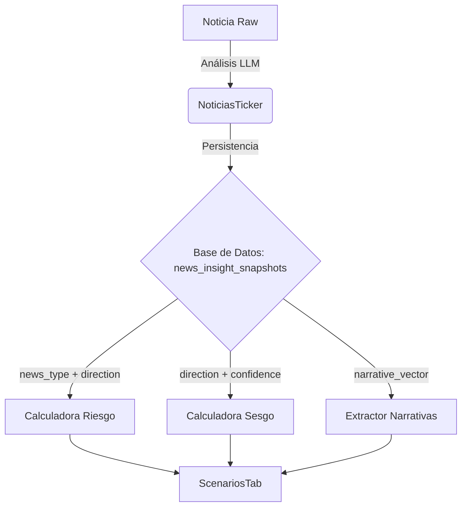

# Relación entre Estados de Noticias y Escenarios (ScenariosTab)

Este documento detalla los estados que se persisten durante el análisis de noticias (`NoticiasTicker`) y cómo estos datos alimentan los modelos analíticos presentados en la pestaña de Escenarios (`ScenariosTab`).

## 1. Estados Persistidos en Base de Datos

Cuando el sistema analiza una noticia (vía `NoticiasTicker` -> `api/news/analyze`), se genera y guarda un registro en la tabla `news_insight_snapshots`. Los campos clave que definen el "estado" de la noticia son:

| Campo | Valores Posibles | Descripción |
|-------|------------------|-------------|
| **`news_type`** | `Hecho`, `Anuncio`, `Opinión`, `Análisis` | Clasificación fundamental del contenido. Los "Hechos" tienen mayor peso en el riesgo que las "Opiniones". |
| **`direction`** | `Positiva`, `Neutra`, `Negativa` | Sentimiento o impacto direccional de la noticia sobre el activo. |
| **`confidence`** | `Alta`, `Media`, `Baja` | Nivel de certeza del modelo LLM sobre su propio análisis. |
| **`evidence_level`** | `high`, `medium`, `low` | (Calculado) Se deriva de la combinación de `news_type` y `confidence`. Determina la "calidad" de la señal. |
| **`is_eligible_for_history`** | `true`, `false` | Indica si la noticia es lo suficientemente relevante para formar parte del historial analítico a largo plazo. |
| **`narrative_vector`** | *Array de strings* | Etiquetas temáticas (ej: `["inflación", "tasas", "crecimiento"]`) que identifican los temas clave. |
| **`explanation`** | *Texto* | Justificación generada por el LLM para su análisis. |

### Propósito de la Persistencia
Guardar estos estados no es solo un registro histórico; es fundamental para:
1.  **Estabilidad**: Evitar re-analizar la misma URL múltiples veces (costo de LLM y latencia).
2.  **Trazabilidad**: Permitir auditoría de por qué el sistema clasificó una noticia de cierta forma.
3.  **Alimentación del Modelo**: Estos "snapshots" son los inputs crudos ("raw data") para los algoritmos de nivel superior (Riesgo, Sesgo, Escenarios).

---

## 2. Relación con ScenariosTab

La pestaña `ScenariosTab` no analiza noticias en tiempo real. En su lugar, **consulta los estados históricos guardados** en `news_insight_snapshots` para construir una visión macro.

La relación se basa en tres métricas derivadas calculadas en `lib/analysis/`:

### A. Riesgo Narrativo (`NarrativeRisk`)
*Archivo: `lib/analysis/narrativeRisk.ts`*

El "Riesgo Narrativo" mide qué tan peligroso es el entorno de noticias actual.
*   **Input**: Toma las noticias recientes filtradas por `evidence_level` y `direction`.
*   **Lógica**:
    *   Si hay muchas noticias con `direction: 'Negativa'` y `evidence_level: 'high'`, el riesgo sube drásticamente.
    *   Una noticia de tipo `Opinión` (baja evidencia) afecta menos al riesgo que un `Hecho` (alta evidencia).
*   **Uso en UI**: Determina si el sistema muestra alertas de "Alta Volatilidad" o "Entorno Hostil" en los escenarios.

### B. Sesgo Narrativo (`NarrativeBias`)
*Archivo: `lib/analysis/narrativeBias.ts`*

El "Sesgo" mide la inclinación psicológica del mercado hacia el activo.
*   **Input**: Agregación de `direction` ponderada por `confidence`.
*   **Lógica**: Suma vectorial de sentimientos.
    *   Muchas noticias `Positivas` con confianza `Alta` generan un Sesgo Alcista fuerte.
    *   Noticias contradictorias generan un Sesgo Neutro o Indeciso.
*   **Uso en UI**: Ajusta las probabilidades de los escenarios (ej: si el sesgo es muy negativo, el escenario "Bear Case" recibe mayor probabilidad visual).

### C. Narrativas Dominantes (`DominantNarratives`)
*Archivo: `lib/analysis/dominantNarratives.ts`*

Identifica los temas recurrentes que están moviendo el precio.
*   **Input**: Frecuencia de términos en el campo `narrative_vector`.
*   **Lógica**: Agrupa y cuenta las etiquetas más repetidas en las noticias recientes elegibles (`is_eligible_for_history: true`).
*   **Uso en UI**: Se muestran como "Temas Clave" en `ScenariosTab`, permitiendo al usuario ver no solo *qué* pasa, sino *de qué se habla* (ej: "Regulatory Pressure", "Earnings Miss").

## Resumen del Flujo de Datos

En conclusión, `NoticiasTicker` es el **sensor** que captura y estructura la realidad átomica (noticia por noticia), mientras que `ScenariosTab` es el **intérprete** que lee esa base de datos estructurada para proyectar tendencias y riesgos agregados.
